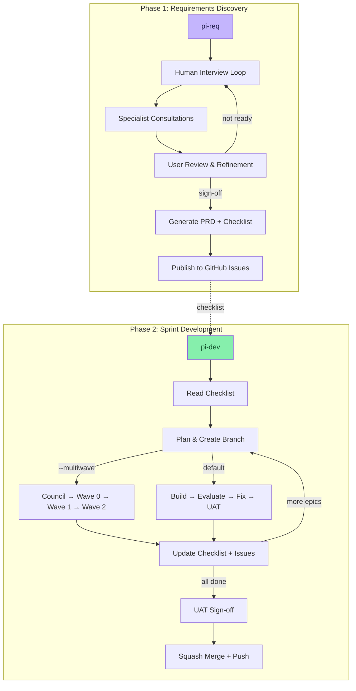
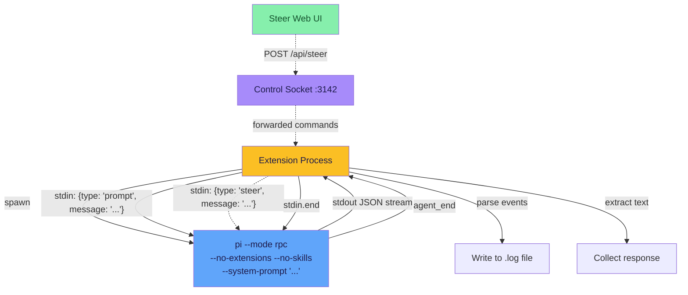
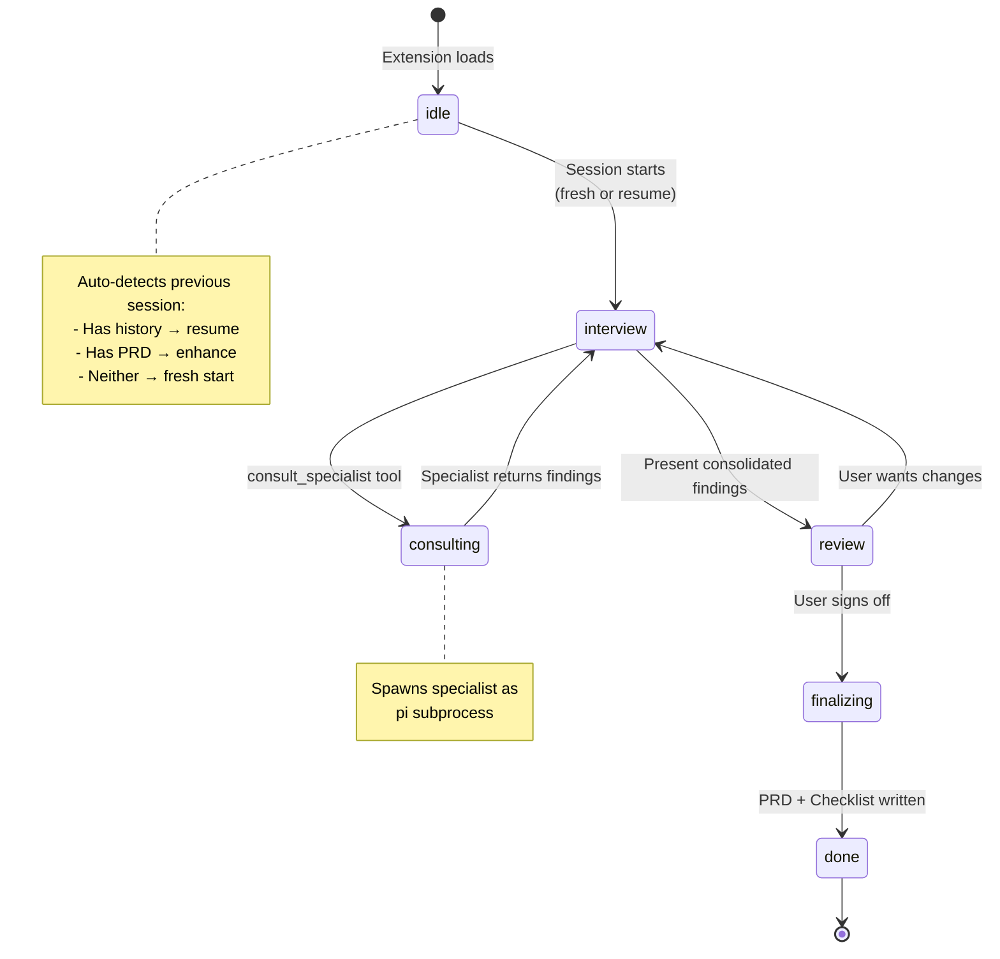
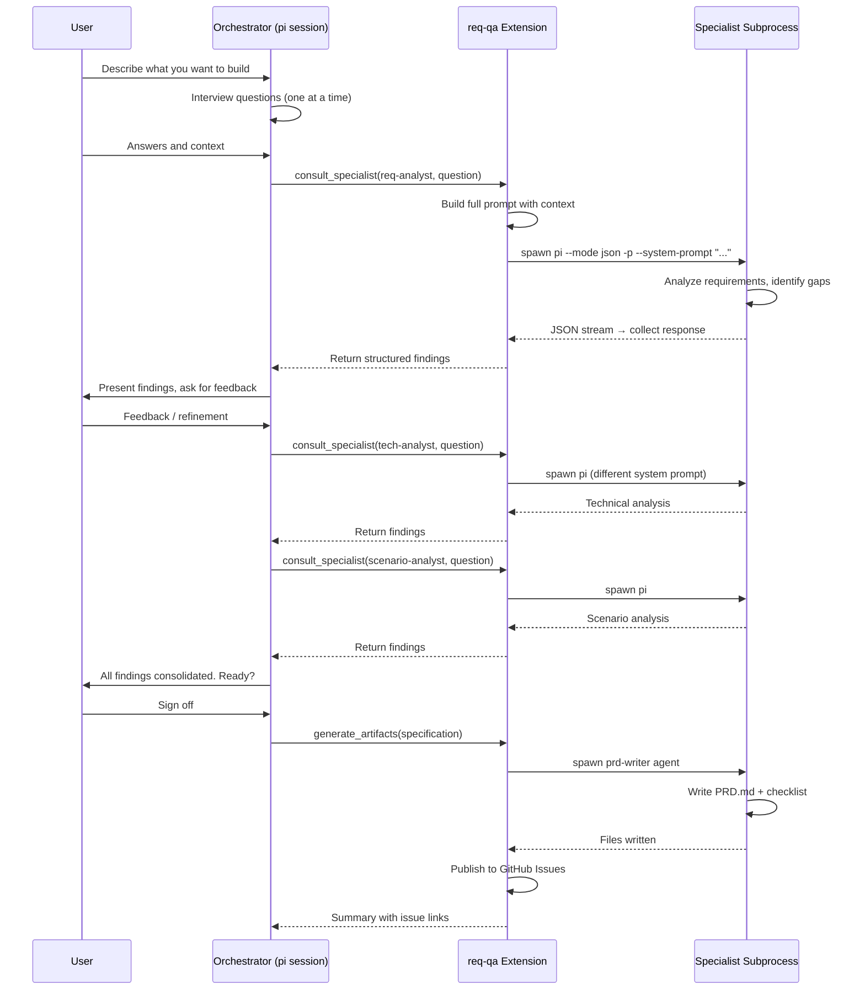
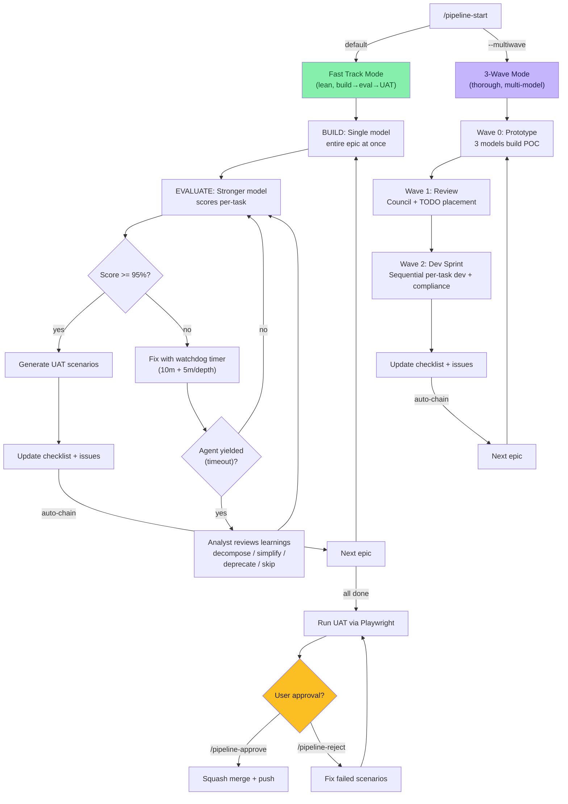
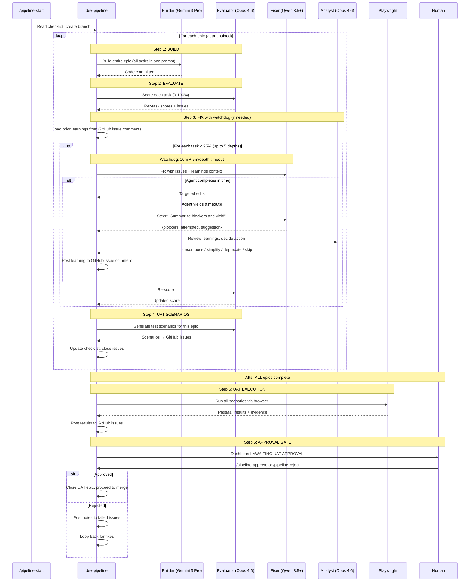
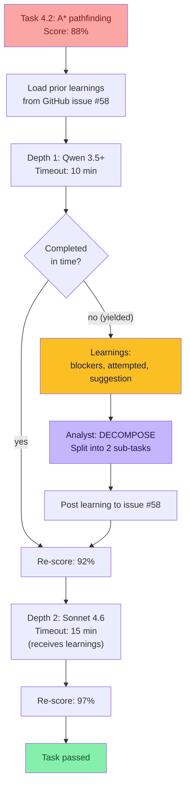
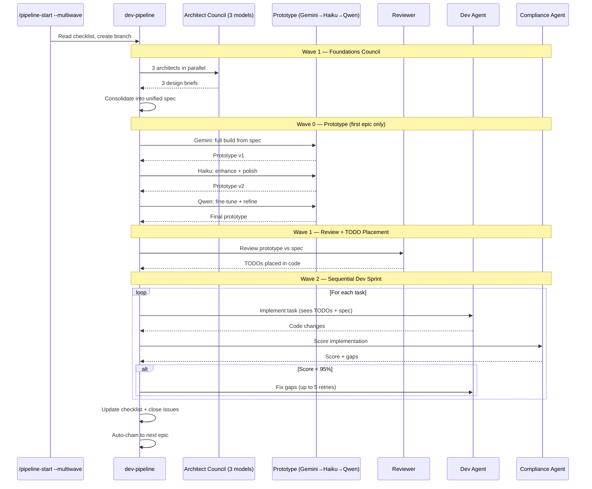
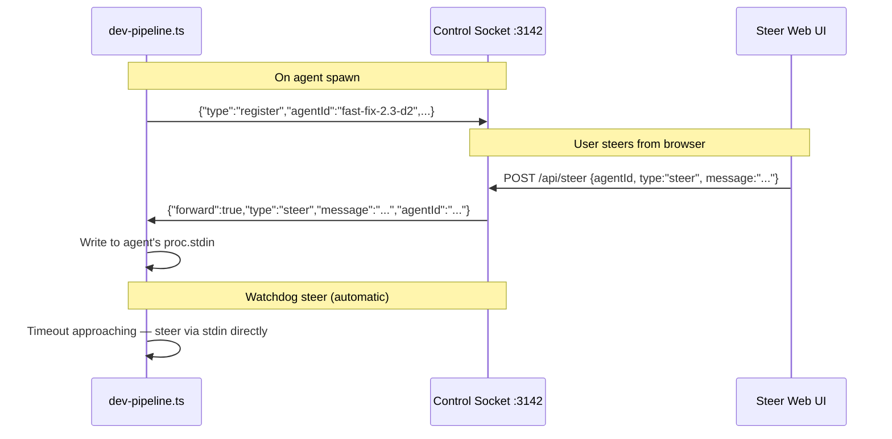

# Pi Extensions — Multi-Agent Development Workflows

Custom extensions for the [pi coding agent CLI](https://github.com/nichochar/pi) that orchestrate multi-agent workflows for requirements discovery and sprint-based development.

## Table of Contents

- [Architecture Overview](#architecture-overview)
- [Documentation Hub](#documentation-hub)
- [Current Repo State](#current-repo-state)
- [Extensions](#extensions)
  - [req-qa — Requirements Discovery](#req-qa--requirements-discovery)
  - [dev-pipeline — Sprint Development](#dev-pipeline--sprint-development)
    - [Fast Track Mode (default)](#fast-track-mode-default)
    - [3-Wave Mode](#3-wave-mode---multiwave)
  - [pi-blueprint — Interactive Planning Cockpit](#pi-blueprint--interactive-planning-cockpit)
  - [pi-toolshed — Card-Based Workbench](#pi-toolshed--card-based-workbench)
  - [Supporting Extensions](#supporting-extensions)
- [Agent Definitions](#agent-definitions)
- [Installation](#installation)
- [Shell Aliases](#shell-aliases)
- [Commands Reference](#commands-reference)

---

## Architecture Overview

The system is built on two main extension pipelines that form a complete software development lifecycle:



### How Agent Subprocess Execution Works

Both extensions spawn agents as pi CLI subprocesses using pi's native RPC mode:



Each agent subprocess:

- Runs `pi` in RPC mode (`--mode rpc`) with stdin/stdout piped
- Receives its task via stdin as `{"type": "prompt", "message": "..."}` — not as a positional arg
- Can be steered mid-execution via `{"type": "steer", "message": "..."}` on stdin
- Can be aborted via `{"type": "abort"}` on stdin
- Streams JSON events (`message_update`, `agent_start`, `agent_end`, `tool_execution_start`, etc.)
- Logs all output to `.pi/pipeline-logs/<session-key>.log`
- Uses session file reuse (`--session <file> -c`) so agents retain context across calls within a phase
- Is tracked in the `agentProcesses` map by session key for steering/monitoring

**Session reuse** means a dev agent called for task 1.1 keeps its conversation context when called again for task 1.2, reducing repeated codebase scanning.

**RPC lifecycle:** `prompt` → `agent_start` → `turn_start` → `message_start` → `message_update` (text deltas) → `message_end` → `tool_execution_start/end` (if tools used) → `turn_end` → `agent_end` → `stdin.end()` (or keep alive for follow-up).

---

## Documentation Hub

| Path                                                                                                         | Purpose                                                                                                |
| ------------------------------------------------------------------------------------------------------------ | ------------------------------------------------------------------------------------------------------ |
| [00-IMPLEMENTATION-CHECKLIST.md](00-IMPLEMENTATION-CHECKLIST.md)                                             | Current rollout checklist and repo alignment tracker                                                   |
| [docs/walkthrough-fasttrack.md](docs/walkthrough-fasttrack.md)                                               | Fast Track workflow walkthrough                                                                        |
| [docs/research-diffusion-llm-code-generation.md](docs/research-diffusion-llm-code-generation.md)             | Research context behind the pipeline design                                                            |
| [docs/designs/pi-toolshed-retrospective-2026-03-26.md](docs/designs/pi-toolshed-retrospective-2026-03-26.md) | Retrospective summary of the Blueprint + Toolshed buildout, issues, lessons, and external-app guidance |
| [PRD-PI-TOOLSHED.md](PRD-PI-TOOLSHED.md)                                                                     | Toolshed product direction                                                                             |
| [TOOLSHED-IMPLEMENTATION-INSTRUCTIONS.md](TOOLSHED-IMPLEMENTATION-INSTRUCTIONS.md)                           | Current toolshed implementation notes                                                                  |
| [.factory/mcp.json](.factory/mcp.json)                                                                       | Canonical project-local MCP server wiring                                                              |
| [.mcp.json](.mcp.json)                                                                                       | Legacy-compatible MCP server wiring mirror                                                             |
| [agents/pi-blueprint/](agents/pi-blueprint/)                                                                 | Repo-managed blueprint agents                                                                          |
| [skills/pi-blueprint/](skills/pi-blueprint/)                                                                 | Repo-managed blueprint skills                                                                          |

## Current Repo State

- `req-qa` and `dev-pipeline` remain the baseline discovery and delivery workflow extensions.
- `pi-blueprint.ts` is the current GitHub-backed planning cockpit, with transcript search, alignment checks, issue rebuilds, asset sync, and a dedicated web mirror.
- `pi-toolshed.ts` is the current card/workspace shell, with frontier packets, workspace presets, quick actions, and blueprint-aware web surfaces.
- Blueprint assets are committed in `agents/pi-blueprint/` and `skills/pi-blueprint/`; use `/blueprint-sync-assets` to mirror them into a project-local `.pi` runtime.

---

## Extensions

### req-qa — Requirements Discovery

**File:** `extensions/req-qa.ts` (~1640 lines)
**Alias:** `pi-req`
**Theme:** rose-pine

An interactive, human-in-the-loop requirements discovery system. The pi session acts as an interviewer, calling specialist agents on demand, with everything gated by user approval.

#### State Machine



#### Consultation Flow (Sequential)

When the orchestrator calls `consult_specialist`, this happens:



#### Tools

| Tool                 | Purpose                                      | Subprocess?                   |
| -------------------- | -------------------------------------------- | ----------------------------- |
| `consult_specialist` | Call a specialist agent for focused analysis | Yes — spawns agent subprocess |
| `generate_artifacts` | Produce PRD + checklist after user sign-off  | Yes — spawns prd-writer       |

#### Specialist Agents

| Agent              | Focus                                                     | Tools                       | Output Format                                 |
| ------------------ | --------------------------------------------------------- | --------------------------- | --------------------------------------------- |
| `req-analyst`      | Functional/non-functional requirements, gaps, assumptions | read, bash, grep, find, ls  | JSON: requirements, open questions, risks     |
| `tech-analyst`     | Technical feasibility, stack analysis, deployment         | read, bash, grep, find, ls  | JSON: tech stack, constraints, data models    |
| `ux-analyst`       | User journeys, workflows, edge cases, navigation          | read, grep, find, ls        | JSON: personas, stories, workflows            |
| `scenario-analyst` | Stress tests, failure modes, real-world validation        | read, bash, grep, find, ls  | JSON: scenarios, failure modes, stress points |
| `prd-writer`       | Synthesize all analysis into PRD + checklist              | read, write, grep, find, ls | Markdown files (PRD.md + checklist)           |

#### Consultation Modes

- **Fast mode** (`deep: false`, default): Specialist gets NO file tools — pure prompt-based analysis. ~15s per call.
- **Deep mode** (`deep: true`): Specialist gets file-reading tools + session persistence. Can examine the actual codebase. ~30-60s per call.

#### Session Persistence

State is saved to `req-qa-state.json` after every consultation and phase change:

```json
{
  "phase": "interview",
  "consultations": [
    {
      "specialist": "req-analyst",
      "question": "What are the core functional requirements?",
      "response": "...",
      "timestamp": 1741000000000,
      "iteration": 1
    }
  ],
  "iteration": 3,
  "timestamp": 1741000000000
}
```

On session startup, the extension auto-detects:

- **Has consultation history** → Resume: inject history into system prompt
- **Has existing PRD** → Enhance: inject PRD content for refinement
- **Neither** → Fresh start

The `before_agent_start` hook dynamically injects consultation history and PRD content into the orchestrator's system prompt, giving it full context without re-running specialists.

#### GitHub Integration

After `generate_artifacts` runs, the extension:

1. Parses the implementation checklist for epics and tasks
2. Creates GitHub issues for each epic (as tracking issues)
3. Creates GitHub issues for each task (linked to epic via `Part of #N` reference)
4. Updates the checklist file with issue numbers (`- [ ] **1.1 — Title** [#42]`)
5. Handles auth validation, repo creation (interactive), and error recovery

`/req-rebuild-issues` can re-publish all issues if GitHub wasn't available during generation.

---

### dev-pipeline — Sprint Development

**File:** `extensions/dev-pipeline.ts` (~3630 lines)
**Alias:** `pi-dev`
**Theme:** midnight-ocean

A command-driven sprint development lifecycle with two execution modes: the lean Fast Track (default) and the thorough 3-Wave architecture. Both read the checklist produced by req-qa and drive tasks through development, compliance, and quality gates.

#### Dual-Mode Architecture



---

#### Fast Track Mode (default)

Activated with `/pipeline-start` (no flags). A streamlined pipeline for faster iteration: one model builds, one evaluates, failed tasks get surgically fixed via subtask decomposition, and automated UAT runs via Playwright at the end.

##### Pipeline Flow



##### Fix with Watchdog Timers & Analyst Escalation

When a task scores below 95%, the fast track doesn't rebuild from scratch. Each fix attempt runs under a watchdog timer — if the agent can't finish in time, it's steered to yield a structured summary, and an analyst agent decides how to proceed.



**Watchdog timer progression:**
| Depth | Timeout | Model |
|-------|---------|-------|
| 1 | 10 min | Base fixer |
| 2 | 15 min | Escalation 1 |
| 3 | 20 min | Escalation 2 |
| 4 | 25 min | Escalation 2 (clamped) |
| 5 | 30 min | Escalation 2 (clamped) |

At **T-30 seconds**, the watchdog steers the agent: "TIMEOUT WARNING: yield NOW and provide a JSON summary of blockers, attempted approaches, and suggestions." At **T**, the agent is aborted and killed.

**Analyst decisions:**
| Action | Effect |
|--------|--------|
| `decompose` | Breaks the task into smaller sub-tasks for the next fix depth |
| `simplify` | Reduces the task scope — overwrites requirements with a simpler version |
| `deprecate` | Marks the task as infeasible — stops trying, moves on |
| `skip` | Skips for now — records conditions under which to retry |

**Learnings flow:**

- Each fix attempt records an `AgentLearning` (blockers, attempted approaches, suggestion, analyst decision)
- Learnings are posted as structured comments on the task's GitHub issue
- Subsequent fix agents receive all prior learnings in their prompt with "DO NOT repeat approaches that have already been tried"
- On pipeline restart, learnings are seeded from issue comments — they survive crashes

##### GitHub Issue Learning Comments

When a fix agent yields or an analyst makes a decision, a structured comment is posted:

```markdown
## Agent Learning (depth 2, fix, claude-sonnet-4-6)

**Yielded:** yes (timeout after 612s)
**Blockers:** collision detection not triggering at maze boundaries; tile cost array index off-by-one
**Attempted:** adjusted hitbox calculations; rewrote boundary detection with BFS
**Suggestion:** try a tile-based grid collision approach instead of pixel-based raycasting
**Analyst:** decompose — split into boundary detection sub-task + ghost collision sub-task
```

These comments accumulate on the issue, forming a visible audit trail of what was tried and why.

##### Stage Widget Bar

A horizontal status bar displayed in the pipeline widget shows real-time progress through the fast track stages:

```
Build ✓ │ Eval ● │ Fix ○ │ UAT Auto ○ │ UAT ○
gemini-3-pro  opus-4.6  qwen-3.5+  gemini-3-pro  playwright
              Task 4.2: A* pathfinding
```

- **✓** = stage completed for current epic
- **●** = stage currently active
- **○** = stage pending
- Active task name shown below the active stage

##### UAT GitHub Issue Structure

```
UAT Epic #101: "UAT Test Suite"                          [uat]
  ├── #102: "UAT: Start game with random seed"           [uat-pass, epic-1]
  ├── #103: "UAT: Ghost chase switches to scatter"       [uat-fail, epic-4]
  ├── #104: "UAT: Power pellet eat chain scoring"        [uat-pending, epic-5]
  ├── #105: "UAT: Level transition animation"            [uat-pass, epic-6]
  └── ...
```

- **Body**: Test instructions (inputs, steps, expected outcomes)
- **Comments**: Execution results posted by Playwright (pass/fail + evidence)
- **Labels**: `uat-pass` / `uat-fail` / `uat-pending` + `epic-N`
- Epic closed only when user runs `/pipeline-approve`

##### Model Assignments (Fast Track)

| Role             | Model                   | Purpose                                                   |
| ---------------- | ----------------------- | --------------------------------------------------------- |
| Builder          | Gemini 3 Pro Preview    | Build entire epic in one shot                             |
| Evaluator        | Claude Opus 4.6         | Per-task scoring + UAT scenario generation                |
| Fixer            | Qwen 3.5 Plus (Bailian) | Surgical subtask fixes (depth 1)                          |
| Fix Escalation 1 | Claude Sonnet 4.6       | Stronger model for depth 2+                               |
| Fix Escalation 2 | Claude Opus 4.6 (xhigh) | Maximum capability for deep escalation                    |
| Analyst          | Claude Opus 4.6 (xhigh) | Reviews yielded agents, decomposes/deprecates stuck tasks |
| UAT Tester       | Gemini 3 Pro Preview    | Playwright browser automation                             |

##### Dashboard — Approval State

When UAT execution completes and the pipeline is waiting for approval, the dashboard widget shows:

```
✓ Epic 1: Foundation & Core Architecture
✓ Epic 2: Procedural Maze Generation
✓ Epic 3: Player Mechanics
● Epic 4: Ghost AI [fast-eval]
  ✓ 4.1: Ghost entity class  98%
  ● 4.2: A* pathfinding  evaluating
  ○ 4.3: Targeting behaviors

⚠ AWAITING UAT APPROVAL — /pipeline-approve or /pipeline-reject
  UAT: 12 pass, 2 fail, 1 pending

Mode: Fast Track
Build ✓ │ Eval ● │ Fix ○ │ UAT Auto ○ │ UAT ○
```

The "AWAITING UAT APPROVAL" line flashes yellow at 2Hz to draw attention.

---

#### 3-Wave Mode (`--multiwave`)

Activated with `/pipeline-start --multiwave`. Best for complex projects requiring maximum quality. Uses multiple models in council for architecture, a 3-step prototype build, and detailed review passes.

##### Pipeline Flow



##### Key Design Decisions

- **Wave 0 runs only for the first epic** — subsequent epics skip it to avoid destroying previous work
- **All Wave 2 operations run sequentially** — no parallel worktrees, preventing merge conflicts on single-file projects
- **Orchestrator override** — when a task scores 90-94%, Opus reviews the deductions and overrides if they're pedantic
- **GitHub issue enrichment** — `enrichTaskBodiesFromGitHub()` fetches full issue bodies via `gh issue view` so agents get complete acceptance criteria, not just checklist summaries
- **Auto-chaining** — epics chain automatically with 5s pause between them, halting on failure

##### Model Assignments (3-Wave)

| Role                  | Model                         | Purpose                     |
| --------------------- | ----------------------------- | --------------------------- |
| Council Architects    | Opus, Qwen 3.5+, Gemini 3 Pro | 3 independent design briefs |
| Prototype Step 1      | Gemini 3 Pro Preview          | Full one-shot build         |
| Prototype Step 2      | Claude Haiku 4.5              | Enhancement pass            |
| Prototype Step 3      | Qwen 3.5 Plus                 | Fine-tuning pass            |
| Dev Agent             | Claude Haiku 4.5              | Task implementation         |
| Compliance            | Qwen 3.5 Plus                 | Per-task scoring            |
| Orchestrator Override | Claude Opus 4.6               | Review pedantic deductions  |

---

#### Shared Infrastructure

Both modes share:

- **Checklist parser** — handles both `### Phase N:` and `## Epic N:` headers, and both `- [ ] #56 - 1.1 Title` and `- [ ] **1.1 — Title** (#N)` task formats
- **GitHub issue enrichment** — fetches full issue bodies via `gh issue view`
- **GitHub issue learnings** — agent learnings posted as structured comments on task issues, read back on pipeline restart
- **RPC agent steering** — all agents run in RPC mode with stdin piped, enabling mid-execution steering
- **Watchdog timers** — per-depth timeout with steer-for-summary and hard yield
- **Auto-chaining** — epics chain automatically with branch creation between them
- **Tmux log panes** — live agent output in tmux splits, auto-closing on completion
- **Pipeline state file** — `pipeline-state.json` for the standalone dashboard
- **Branch management** — each epic gets its own branch chained from the previous
- **Checkpoint system** — save/resume for long-running pipelines
- **Configurable models** — `/pipeline-config` to assign models to each pipeline role

#### Model Configuration (`/pipeline-config`)

Opens a full-screen configuration view with two mode tabs (Fast Track and 3-Wave) listing every pipeline role, its assigned model, and reasoning level. Takes over the entire viewport for clarity.

Each role shows its model and thinking level (e.g. `gemini-3-pro · high`). Press **Enter** to change the model, or **Space** to cycle the thinking level (`off → minimal → low → medium → high → xhigh`).

```
──────────────────────────────────────────────────

  Pipeline Configuration
  Model assignments for each pipeline role

──────────────────────────────────────────────────

→ [Fast Track]  3-Wave        Tab/← → to switch
  Builder                     gemini-3-pro · high
  Evaluator                   claude-opus-4-6 · high
  Fixer                       qwen3.5-plus · high
    ↳ Escalation 1            claude-sonnet-4-6 · high
    ↳ Escalation 2            claude-opus-4-6 · xhigh
    ↳ + Add escalation step
  Analyst                     claude-opus-4-6 · xhigh
  UAT Tester                  gemini-3-pro · medium

  Reviews yielded agents · Space to cycle thinking · Del to remove

  Enter: change model · Space: cycle thinking · Del: remove escalation · Esc: close
──────────────────────────────────────────────────
```

**Fix Escalation** — when a task fails at depth 1, the pipeline escalates to the next configured model/thinking pair. Depth 1 uses the base Fixer, depth 2 uses Escalation 1, depth 3 uses Escalation 2, etc. You can add as many escalation steps as you want (Enter on "+ Add escalation step") or remove them (Del/Backspace on any escalation row). If depths exceed the configured escalation steps, the last step is reused.

On Enter, a model selector opens with two tabs:

- **Available** — only models with configured API keys (ready to use)
- **All** — every registered model (including unconfigured ones)

Press Tab to switch between Available and All. The header shows the count for each.

```
──────────────────────────────────────────────────

  Select Model
  Current: gemini-3-pro-preview

  [Available (12)]  All (45)    Tab to switch

──────────────────────────────────────────────────

→ anthropic/claude-opus-4-6       Claude Opus 4.6
  anthropic/claude-sonnet-4-6     Claude Sonnet 4.6
  bailian/qwen3.5-plus            Qwen 3.5 Plus
  google-gemini-cli/gemini-3-pro  Gemini 3 Pro Preview
  ...

  Enter to select and ping · Esc to cancel
──────────────────────────────────────────────────
```

Selecting a model triggers a quick ping test to confirm it responds. On success, the assignment is saved to `~/.pi/agent/pipeline-config.json` and takes effect immediately — no restart needed.

##### Observer Mode

When a second `pi-dev` terminal is opened while a pipeline is already running, the extension enters **observer mode**:

- The widget polls `pipeline-state.json` every 3 seconds and shows live progress
- All mutating commands (`/pipeline-start`, `/pipeline-next`, `/pipeline-reset`, `/pipeline-approve`, `/pipeline-reject`, `/pipeline-end`) are blocked
- Read-only commands still work: `/pipeline-status`, `/pipeline-config`, `/pipeline-logs`, `/pipeline-watch`, `/pipeline-dashboard`
- Automatically exits observer mode when the running pipeline finishes

```
OBSERVER MODE — another pipeline instance is running

✓ Epic 1: Foundation & Core Architecture
● Epic 2: Procedural Maze Generation (6 remaining) [wave2-compliance]
  ✓ 2.1: Mulberry32 PRNG implementation 95%
  ● 2.3: Horizontal symmetry mirror  building
  ○ 2.4: Ghost house stamp
○ Epic 3: Player Mechanics (4 remaining)

Refreshing every 3s. Pipeline commands are disabled.
```

#### Pipeline State File

Written to `.pi/pipeline-logs/pipeline-state.json` on every state change:

```json
{
  "ts": 1741000000000,
  "running": true,
  "branch": "feature/epic-4-ghost-ai",
  "currentPhase": 3,
  "phases": [
    {
      "name": "Epic 1: Foundation & Core Architecture",
      "isCurrent": false,
      "allDone": true,
      "pending": 0,
      "total": 7,
      "gate": "done"
    },
    {
      "name": "Epic 4: Ghost AI",
      "isCurrent": true,
      "allDone": false,
      "pending": 4,
      "total": 6,
      "gate": "wave2-parallel",
      "tasks": [
        {
          "id": "4.1",
          "title": "Ghost entity class",
          "status": "passed",
          "complianceScore": 98,
          "attempts": 1,
          "yields": 0
        },
        {
          "id": "4.2",
          "title": "A* pathfinding",
          "status": "building",
          "complianceScore": 0,
          "attempts": 2,
          "yields": 1,
          "lastAnalystAction": "decompose"
        }
      ]
    }
  ],
  "log": [
    "[08:05:13] [FAST] BUILD: gemini-3-pro-preview building entire epic..."
  ],
  "activeAgent": {
    "name": "dev",
    "model": "gemini-3-pro-preview",
    "hint": "Build entire epic..."
  }
}
```

#### Live Dashboard

**File:** `bin/pipeline-dashboard`
**Alias:** `pi-dash`

A standalone bash script that reads `pipeline-state.json` every 2 seconds and renders a live terminal dashboard with:

- Animated spinners for active work
- Color-coded task status (green=passed, blue=building, cyan=scoring, red=failed, dim=pending)
- Compliance scores with color thresholds (green >= 95%, yellow >= 80%, red < 80%)
- Phase elapsed time
- Recent activity log (last 12 entries, color-coded)
- Live tail of the active agent's log output
- UAT approval status (yellow flashing when awaiting)

Run standalone: `pi-dash /path/to/project`
Or from inside pi: `/pipeline-dashboard` (opens in a tmux pane)

#### Pipeline Control Center (Web)

**File:** `bin/pipeline-dashboard-web`

A multi-page web application for monitoring and steering agents from a browser.

**Home** (`http://localhost:3141/`) — navigation cards to Dashboard and Steer pages.

**Dashboard** (`/dashboard`) — live SSE-powered view of pipeline state, same data as the terminal dashboard but rendered in HTML with the Claude/shadcn oklch theme (dark/light toggle).

**Steer** (`/steer`) — interactive agent steering page:

- Active agent list (auto-refreshes every 3s)
- Message textarea with Steer / Follow-up / Abort buttons
- Live steer log via SSE showing command history

**TCP Control Socket** (port 3142) — programmatic interface for agent registration and command forwarding:



The extension auto-connects to the control socket on startup and re-registers agents on reconnect. If the web dashboard isn't running, steering still works via the watchdog timers.

#### Agent Steering via RPC

Pi's native RPC mode enables mid-execution steering of any running agent:

| RPC Command                               | Effect                                                 |
| ----------------------------------------- | ------------------------------------------------------ |
| `{"type": "prompt", "message": "..."}`    | Send initial task (on spawn)                           |
| `{"type": "steer", "message": "..."}`     | Interrupt agent, deliver new instructions              |
| `{"type": "follow_up", "message": "..."}` | Continue conversation after `agent_end` (if keepAlive) |
| `{"type": "abort"}`                       | Cancel current execution                               |

Steering sources:

1. **Watchdog timer** — automatic yield summary request at timeout
2. **Web UI** — user types a message on the `/steer` page
3. **Control socket** — programmatic steering from any TCP client

---

### pi-blueprint — Interactive Planning Cockpit

**File:** `extensions/pi-blueprint.ts`
**Usage:** `pi -ne -e extensions/pi-blueprint.ts -e extensions/theme-cycler.ts`

GitHub-backed planning workflow that adds transcript-backed specialist consultations, PRD/checklist generation, alignment scoring, issue rebuild/recovery, and repo-managed asset sync.

Current repo surfaces tied to blueprint:

- `agents/pi-blueprint/` — planning agents committed with the repo
- `skills/pi-blueprint/` — planning skills committed with the repo
- `bin/blueprint-dashboard-web` — live Blueprint web mirror

Key commands:

| Command                      | Description                                      |
| ---------------------------- | ------------------------------------------------ |
| `/blueprint-status`          | Show current planning status                     |
| `/blueprint-web`             | Open the live Blueprint web mirror               |
| `/blueprint-details`         | Open the detailed Blueprint overlay              |
| `/blueprint-sync-assets`     | Sync repo-managed agents/skills into local `.pi` |
| `/blueprint-check-alignment` | Validate transcript-backed decisions             |
| `/blueprint-rebuild-issues`  | Recover or rebuild GitHub issues from artifacts  |

---

### pi-toolshed — Card-Based Workbench

**File:** `extensions/pi-toolshed.ts`

Interactive card/workspace shell for frontier packets, quick actions, workspace presets, and blueprint-aware planning handoffs.

Current repo surfaces tied to toolshed:

- `bin/toolshed-dashboard-web` — browser UI for the toolshed workspace
- `PRD-PI-TOOLSHED.md` — product direction
- `TOOLSHED-IMPLEMENTATION-INSTRUCTIONS.md` — implementation notes

Key commands:

| Command                  | Description                               |
| ------------------------ | ----------------------------------------- |
| `/toolshed-web`          | Open the toolshed web workspace           |
| `/toolshed-status`       | Show current toolshed state               |
| `/toolshed-workspace`    | Switch workspace/card deck                |
| `/toolshed-freeze`       | Freeze the current frontier into a packet |
| `/toolshed-packets`      | Inspect queued packets                    |
| `/toolshed-reset-layout` | Reset card layout/collapse state          |

---

### Supporting Extensions

| Extension         | Purpose                                                                                       |
| ----------------- | --------------------------------------------------------------------------------------------- |
| `themeMap.ts`     | Maps each extension to a default theme. Called on session start to auto-apply visual styling. |
| `theme-cycler.ts` | Registers `/theme` command for cycling between installed themes at runtime.                   |

---

## Agent Definitions

Agent definitions live in `agents/` as markdown files with YAML frontmatter:

```markdown
---
name: dev
description: Autonomous development agent
tools: read,write,edit,bash,grep,find,ls
---

System prompt content here...
```

The extensions scan three directories for agents (first match wins):

1. `<project>/.pi/agents/` — project-specific overrides
2. `~/.pi/agent/agents/` — pi global agents
3. `~/.pi-init/agents/` — custom agents (this repo)

### Agent Capability Matrix

```
Agent            │ read │ write │ edit │ bash │ grep │ find │ ls │
─────────────────┼──────┼───────┼──────┼──────┼──────┼──────┼────┤
dev              │  ✓   │   ✓   │  ✓   │  ✓   │  ✓   │  ✓   │ ✓  │ ← only agent that writes
compliance       │  ✓   │       │      │  ✓   │  ✓   │  ✓   │ ✓  │
analyst          │  ✓   │       │      │      │  ✓   │  ✓   │ ✓  │ ← reviews yielded agents
reviewer         │  ✓   │       │      │  ✓   │  ✓   │  ✓   │ ✓  │
lint-build       │  ✓   │       │      │  ✓   │  ✓   │  ✓   │ ✓  │
tester           │  ✓   │       │      │  ✓   │  ✓   │  ✓   │ ✓  │
uat-signoff      │  ✓   │       │      │  ✓   │  ✓   │  ✓   │ ✓  │
sharder          │  ✓   │       │      │      │  ✓   │  ✓   │ ✓  │
req-analyst      │  ✓   │       │      │  ✓   │  ✓   │  ✓   │ ✓  │
tech-analyst     │  ✓   │       │      │  ✓   │  ✓   │  ✓   │ ✓  │
ux-analyst       │  ✓   │       │      │      │  ✓   │  ✓   │ ✓  │
scenario-analyst │  ✓   │       │      │  ✓   │  ✓   │  ✓   │ ✓  │
prd-writer       │  ✓   │   ✓   │      │      │  ✓   │  ✓   │ ✓  │
```

Only `dev` and `prd-writer` have write access. All other agents are read-only by design — they analyze and report, they do not modify.

---

## Installation

```bash
# 1. Clone into your workspace
git clone <repo-url> ~/workspace/pi-extensions

# 2. Symlink to ~/.pi-init (where pi loads from)
ln -sf ~/workspace/pi-extensions/extensions ~/.pi-init/extensions
ln -sf ~/workspace/pi-extensions/agents/req-qa/* ~/.pi-init/agents/
ln -sf ~/workspace/pi-extensions/agents/dev-pipeline/* ~/.pi-init/agents/
ln -sf ~/workspace/pi-extensions/bin/pipeline-dashboard ~/.pi-init/bin/pipeline-dashboard
ln -sf ~/workspace/pi-extensions/bin/pipeline-dashboard-web ~/.pi-init/bin/pipeline-dashboard-web
ln -sf ~/workspace/pi-extensions/bin/blueprint-dashboard-web ~/.pi-init/bin/blueprint-dashboard-web
ln -sf ~/workspace/pi-extensions/bin/toolshed-dashboard-web ~/.pi-init/bin/toolshed-dashboard-web

# 3. Install dependencies
cd ~/.pi-init && npm install @mariozechner/pi-tui

# 4. Add aliases to ~/.zshrc
_PIX="$HOME/.pi-init/extensions"
alias pi-dev='pi -ne -e "$_PIX/dev-pipeline.ts" -e "$_PIX/theme-cycler.ts"'
alias pi-req='pi -ne -e "$_PIX/req-qa.ts" -e "$_PIX/theme-cycler.ts"'
alias pi-blueprint='pi -ne -e "$_PIX/pi-blueprint.ts" -e "$_PIX/theme-cycler.ts"'
alias pi-dash='~/.pi-init/bin/pipeline-dashboard'
alias pi-web='~/.pi-init/bin/pipeline-dashboard-web'

# 5. Install glow for PRD rendering (optional)
brew install glow
```

### Prerequisites

- [pi coding agent CLI](https://github.com/nichochar/pi) installed globally
- Node.js 20+
- `uv` / `uvx` available on PATH for retrieval MCP launch
- GitHub CLI (`gh`) authenticated for issue publishing
- tmux (for log panes and dashboard)
- glow (optional, for `/req-prd` markdown rendering)

### Retrieval MCPs

This repo expects the Munch retrieval servers to be configured in project MCP config and launched through `uvx`, following the upstream `jcodemunch-mcp` quickstart pattern.

Canonical config lives in [.factory/mcp.json](.factory/mcp.json) and is mirrored into [.mcp.json](.mcp.json) for legacy compatibility. The configured retrieval servers are:

- `jcodemunch` for code structure and symbol lookup
- `jdocmunch` for markdown and document-section retrieval
- `jdatamunch` for structured data surfaces

Policy for repo-managed agents:

- Use jCodeMunch before raw code reads or shell grep for source exploration
- Use jDocMunch before raw markdown reads for PRDs, checklists, and docs
- Use jDataMunch before ad hoc shell inspection for structured data artifacts
- Fall back to raw file or shell inspection only when the relevant retrieval MCP is unavailable or insufficient

Validation:

```bash
bin/verify-munch-mcps
```

Sync the active global Pi MCP config/cache for the Munch servers:

```bash
bin/sync-pi-munch-mcps
```

Recommended recovery flow when a new Pi session is missing one of the Munch servers:

1. Run `bin/verify-munch-mcps`
2. Run `bin/sync-pi-munch-mcps`
3. Start a fresh Pi session
4. Run `mcp({})` and confirm `jcodemunch`, `jdocmunch`, and `jdatamunch` are present

Why this exists: in this environment, the active MCP adapter reads `~/.pi/agent/mcp.json` and `~/.pi/agent/mcp-cache.json`. Repo-local `.factory/mcp.json` / `.mcp.json` remain the canonical project config, but syncing keeps the active Pi MCP registry aligned for new sessions.

If Pi is already running after MCP config changes, restart it so discovery reloads the updated project config.

---

## Shell Aliases

| Alias          | Purpose                                         |
| -------------- | ----------------------------------------------- |
| `pi-req`       | Launch requirements discovery session           |
| `pi-dev`       | Launch sprint development pipeline              |
| `pi-blueprint` | Launch the Blueprint planning cockpit           |
| `pi-dash`      | Launch standalone terminal dashboard            |
| `pi-web`       | Launch Pipeline Control Center (web, port 3141) |

---

## Commands Reference

### req-qa Commands

| Command               | Description                                 |
| --------------------- | ------------------------------------------- |
| `/req-status`         | Show current phase and consultation count   |
| `/req-history`        | Show all specialist consultations           |
| `/req-logs`           | Open all specialist logs in tmux panes      |
| `/req-watch <name>`   | Tail a specific specialist's log            |
| `/req-close-panes`    | Close all tmux log panes                    |
| `/req-prd`            | View PRD in glow (rendered markdown)        |
| `/req-rebuild-issues` | Re-publish all GitHub issues from checklist |
| `/req-reset`          | Clear session state and start fresh         |

### dev-pipeline Commands

| Command                       | Description                                                                   |
| ----------------------------- | ----------------------------------------------------------------------------- |
| `/pipeline-start`             | Initialize pipeline in Fast Track mode (default)                              |
| `/pipeline-start --multiwave` | Initialize pipeline in 3-Wave mode                                            |
| `/pipeline-next`              | Run next phase (uses active mode)                                             |
| `/pipeline-approve`           | Approve UAT results (Fast Track)                                              |
| `/pipeline-reject`            | Reject UAT with notes, loop back (Fast Track)                                 |
| `/pipeline-reset`             | Full reset — checkout main, delete branches, uncheck checklist, reopen issues |
| `/pipeline-end`               | UAT sign-off, squash merge to main, push, clean up                            |
| `/pipeline-config`            | Configure model assignments for each pipeline role                            |
| `/pipeline-status`            | Show current pipeline progress                                                |
| `/pipeline-dashboard`         | Open live dashboard in tmux pane                                              |
| `/pipeline-logs`              | Open all agent logs in tmux panes                                             |
| `/pipeline-watch <name>`      | Tail a specific agent's log                                                   |
| `/pipeline-close-panes`       | Close all tmux/dashboard panes                                                |

### pi-blueprint Commands

| Command                      | Description                                          |
| ---------------------------- | ---------------------------------------------------- |
| `/blueprint-status`          | Show current planning phase and readiness            |
| `/blueprint-history`         | Show consultation history                            |
| `/blueprint-prd`             | Open the generated PRD                               |
| `/blueprint-checklist`       | Open the generated checklist                         |
| `/blueprint-web`             | Open the live Blueprint web mirror                   |
| `/blueprint-sync-assets`     | Sync repo-managed agents and skills into local `.pi` |
| `/blueprint-check-alignment` | Verify transcript-backed alignment                   |
| `/blueprint-rebuild-issues`  | Rebuild or recover GitHub issues                     |

### pi-toolshed Commands

| Command                  | Description                              |
| ------------------------ | ---------------------------------------- |
| `/toolshed-web`          | Open the toolshed web workspace          |
| `/toolshed-status`       | Show current toolshed state              |
| `/toolshed-workspace`    | Switch active workspace preset           |
| `/toolshed-freeze`       | Freeze the active frontier into a packet |
| `/toolshed-packets`      | Inspect the packet queue                 |
| `/toolshed-reset-layout` | Reset card collapse state                |

---

## File Structure

```
pi-extensions/
├── 00-IMPLEMENTATION-CHECKLIST.md
├── .mcp.json
├── PRD-PI-TOOLSHED.md
├── README.md
├── TOOLSHED-IMPLEMENTATION-INSTRUCTIONS.md
├── extensions/
│   ├── req-qa.ts              # Requirements discovery extension
│   ├── dev-pipeline.ts        # Sprint development extension
│   ├── pi-blueprint.ts        # GitHub-backed planning cockpit
│   ├── pi-toolshed.ts         # Card/workspace shell
│   ├── bailian-provider.ts    # Alibaba Cloud Bailian provider
│   ├── qwen-provider.ts       # Qwen CLI provider (OAuth PKCE)
│   ├── glm-provider.ts        # Zhipu GLM provider
│   ├── ollama-provider.ts     # Ollama local models provider
│   ├── themeMap.ts            # Per-extension theme assignments
│   └── theme-cycler.ts        # Runtime theme switching
├── agents/
│   ├── req-qa/                # Requirements discovery agents
│   │   ├── req-analyst.md
│   │   ├── tech-analyst.md
│   │   ├── ux-analyst.md
│   │   ├── scenario-analyst.md
│   │   └── prd-writer.md
│   ├── pi-blueprint/          # Repo-managed blueprint agents
│   └── dev-pipeline/          # Development pipeline agents
│       ├── dev.md
│       ├── compliance.md
│       ├── reviewer.md
│       ├── lint-build.md
│       ├── tester.md
│       ├── uat-signoff.md
│       └── sharder.md
├── skills/
│   └── pi-blueprint/          # Repo-managed blueprint skills
├── bin/
│   ├── pipeline-dashboard     # Standalone terminal dashboard (bash)
│   ├── pipeline-dashboard-web # Pipeline Control Center (Node.js HTTP + SSE + TCP)
│   ├── blueprint-dashboard-web # Blueprint web mirror
│   └── toolshed-dashboard-web # Toolshed workspace UI
└── docs/
    ├── walkthrough-fasttrack.md
    └── research-diffusion-llm-code-generation.md
```

## Performance Characteristics

### 3-Wave Mode

| Step                             | Duration | Notes                            |
| -------------------------------- | -------- | -------------------------------- |
| Foundations Council (3 parallel) | ~60-90s  | 3 architect models in parallel   |
| Wave 0 Prototype (3 sequential)  | ~3-5 min | Gemini → Haiku → Qwen            |
| Wave 1 Review + TODOs            | ~60-90s  | Review + TODO placement          |
| Wave 2 Dev (per task)            | ~35-75s  | Sequential implementation        |
| Wave 2 Compliance (per task)     | ~30-40s  | Per-task scoring                 |
| Wave 2 Fix attempt               | ~35-75s  | Targeted gap fixes               |
| Orchestrator Override            | ~30-45s  | Opus reviews pedantic deductions |

A 7-task epic with fix attempts typically takes 15-25 minutes.

### Fast Track Mode

| Step                         | Duration  | Notes                                               |
| ---------------------------- | --------- | --------------------------------------------------- |
| Build (entire epic)          | ~2-4 min  | Single model, all tasks at once                     |
| Evaluate (per-task scoring)  | ~60-90s   | Single pass                                         |
| Fix depth (per failed task)  | ~1-10 min | Surgical edit + re-score (watchdog: 10m + 5m/depth) |
| Analyst review (if yielded)  | ~1-3 min  | Analyzes learnings, decides next action             |
| UAT scenario generation      | ~60-90s   | Per-epic, runs in parallel with compliance          |
| UAT execution (per scenario) | ~30-60s   | Playwright browser automation                       |

A 7-task epic with 2 fix depths typically takes 5-10 minutes. If agents yield and analyst intervention is needed, fix stages can take longer (up to 30 min for deep escalation). Full UAT execution across all epics adds 5-15 minutes depending on scenario count.

### Comparison

|                        | 3-Wave                              | Fast Track                           |
| ---------------------- | ----------------------------------- | ------------------------------------ |
| **LLM calls per epic** | 15-30+                              | 3-8                                  |
| **Time per epic**      | 15-25 min                           | 5-10 min                             |
| **Quality approach**   | Multi-model consensus               | Single builder + strong evaluator    |
| **Fix strategy**       | Re-attempt with gap feedback        | Surgical subtask decomposition       |
| **UAT**                | Manual sign-off                     | Automated Playwright + approval gate |
| **Best for**           | Complex architectures, first builds | Iteration, known patterns, speed     |
