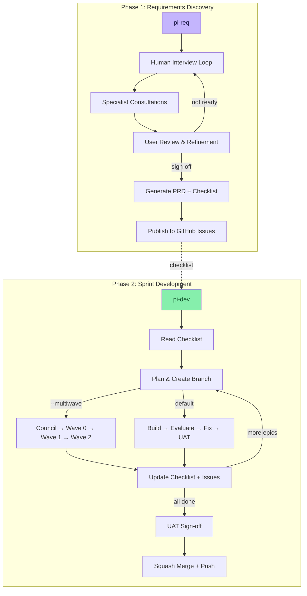
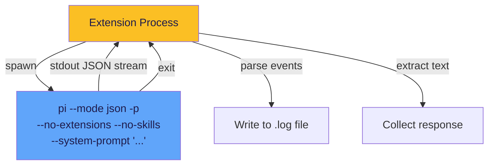
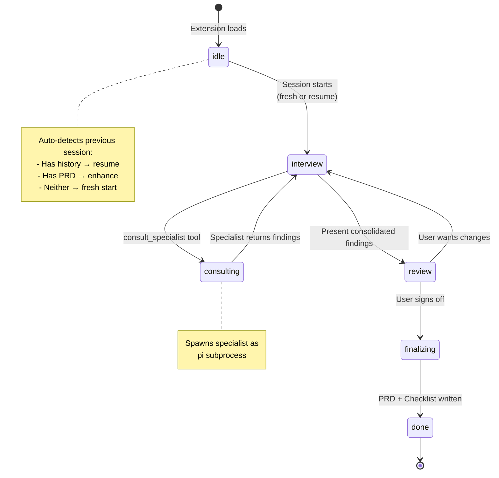
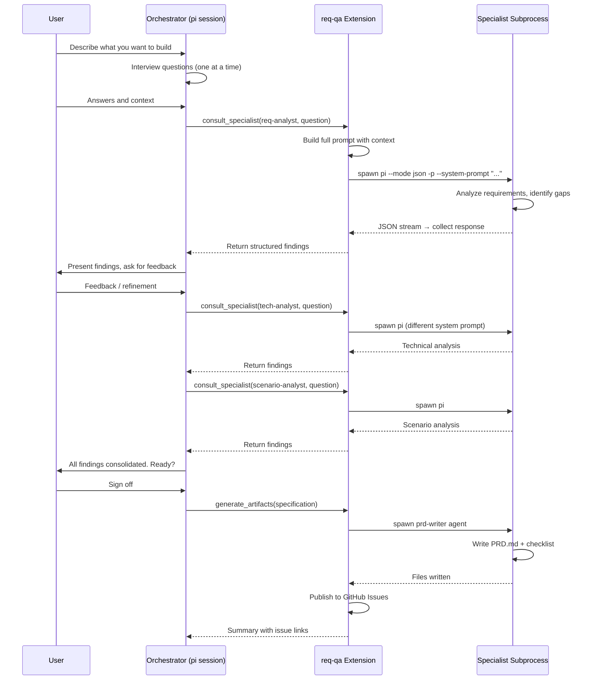
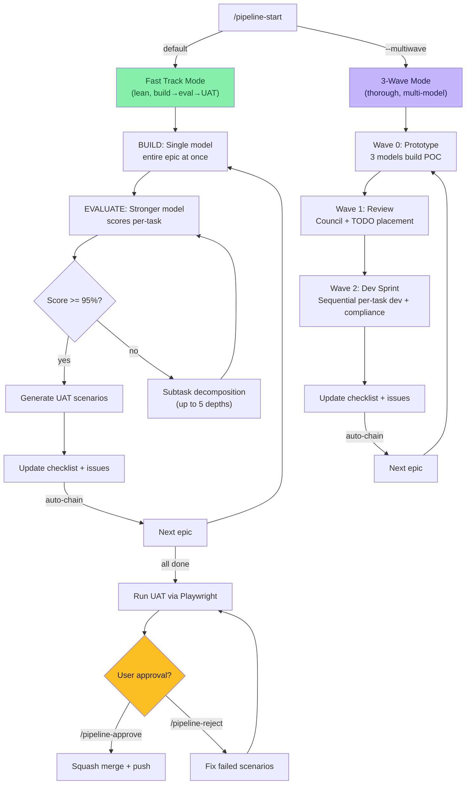
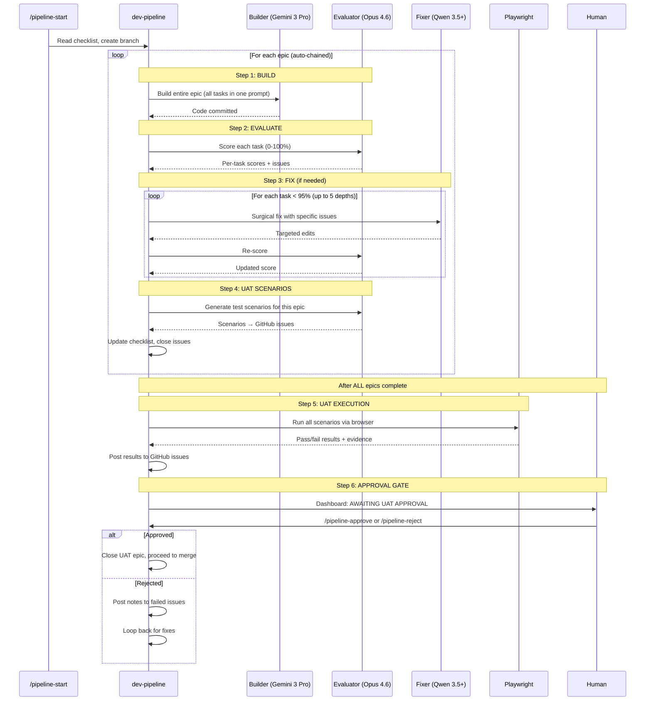
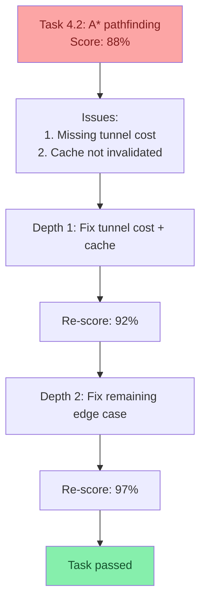
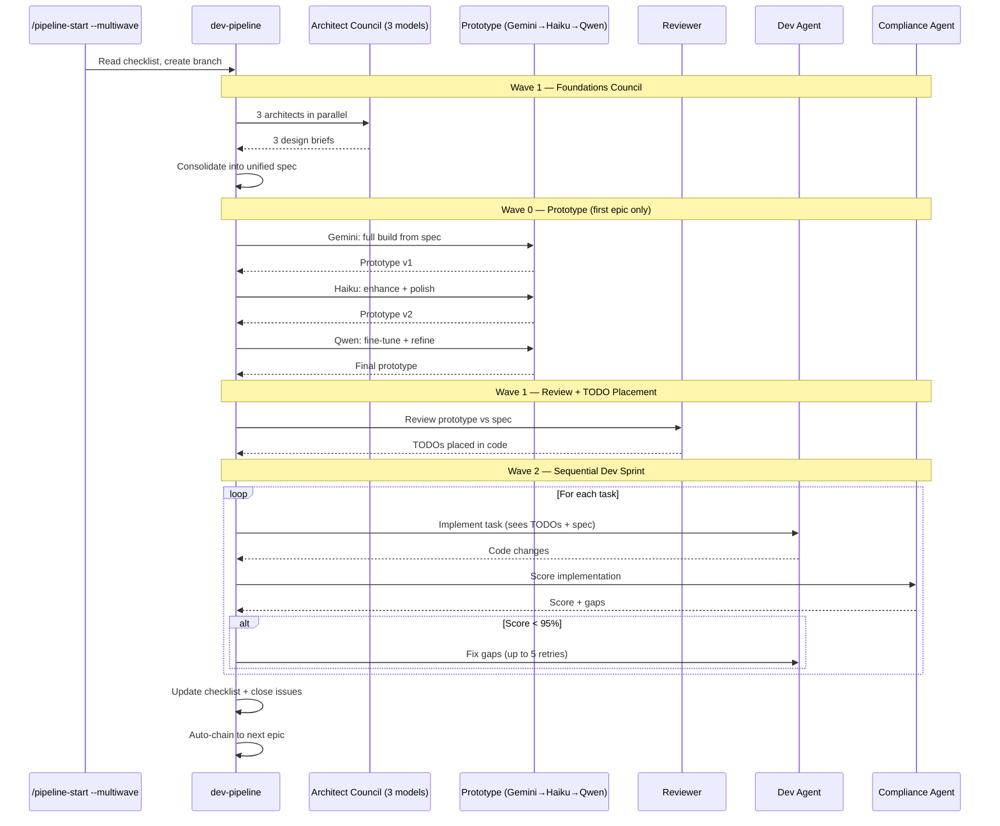

# Pi Extensions — Multi-Agent Development Workflows

Custom extensions for the [pi coding agent CLI](https://github.com/nichochar/pi) that orchestrate multi-agent workflows for requirements discovery and sprint-based development.

## Table of Contents

- [Architecture Overview](#architecture-overview)
- [Extensions](#extensions)
  - [req-qa — Requirements Discovery](#req-qa--requirements-discovery)
  - [dev-pipeline — Sprint Development](#dev-pipeline--sprint-development)
    - [Fast Track Mode (default)](#fast-track-mode-default)
    - [3-Wave Mode](#3-wave-mode---multiwave)
  - [Supporting Extensions](#supporting-extensions)
- [Agent Definitions](#agent-definitions)
- [Installation](#installation)
- [Shell Aliases](#shell-aliases)
- [Commands Reference](#commands-reference)

---

## Architecture Overview

The system is built on two main extension pipelines that form a complete software development lifecycle:



### How Agent Subprocess Execution Works

Both extensions spawn agents as pi CLI subprocesses. This is the core execution pattern:



Each agent subprocess:
- Runs `pi` in JSON streaming mode (`--mode json -p`)
- Loads no extensions, skills, or prompt templates (`--no-extensions --no-skills --no-prompt-templates`)
- Receives a custom system prompt from its agent definition file (`--system-prompt "..."`)
- Gets specific tools based on role (e.g. dev gets `write,edit,bash`; compliance gets `read,bash,grep`)
- Streams JSON events (`message_update`, `tool_execution_start`, `tool_execution_end`)
- Logs all output to `.pi/pipeline-logs/<session-key>.log`
- Uses session file reuse (`--session <file> -c`) so agents retain context across calls within a phase

**Session reuse** means a dev agent called for task 1.1 keeps its conversation context when called again for task 1.2, reducing repeated codebase scanning.

---

## Extensions

### req-qa — Requirements Discovery

**File:** `extensions/req-qa.ts` (~1640 lines)
**Alias:** `pi-req`
**Theme:** rose-pine

An interactive, human-in-the-loop requirements discovery system. The pi session acts as an interviewer, calling specialist agents on demand, with everything gated by user approval.

#### State Machine



#### Consultation Flow (Sequential)

When the orchestrator calls `consult_specialist`, this happens:



#### Tools

| Tool | Purpose | Subprocess? |
|------|---------|-------------|
| `consult_specialist` | Call a specialist agent for focused analysis | Yes — spawns agent subprocess |
| `generate_artifacts` | Produce PRD + checklist after user sign-off | Yes — spawns prd-writer |

#### Specialist Agents

| Agent | Focus | Tools | Output Format |
|-------|-------|-------|---------------|
| `req-analyst` | Functional/non-functional requirements, gaps, assumptions | read, bash, grep, find, ls | JSON: requirements, open questions, risks |
| `tech-analyst` | Technical feasibility, stack analysis, deployment | read, bash, grep, find, ls | JSON: tech stack, constraints, data models |
| `ux-analyst` | User journeys, workflows, edge cases, navigation | read, grep, find, ls | JSON: personas, stories, workflows |
| `scenario-analyst` | Stress tests, failure modes, real-world validation | read, bash, grep, find, ls | JSON: scenarios, failure modes, stress points |
| `prd-writer` | Synthesize all analysis into PRD + checklist | read, write, grep, find, ls | Markdown files (PRD.md + checklist) |

#### Consultation Modes

- **Fast mode** (`deep: false`, default): Specialist gets NO file tools — pure prompt-based analysis. ~15s per call.
- **Deep mode** (`deep: true`): Specialist gets file-reading tools + session persistence. Can examine the actual codebase. ~30-60s per call.

#### Session Persistence

State is saved to `req-qa-state.json` after every consultation and phase change:

```json
{
  "phase": "interview",
  "consultations": [
    {
      "specialist": "req-analyst",
      "question": "What are the core functional requirements?",
      "response": "...",
      "timestamp": 1741000000000,
      "iteration": 1
    }
  ],
  "iteration": 3,
  "timestamp": 1741000000000
}
```

On session startup, the extension auto-detects:
- **Has consultation history** → Resume: inject history into system prompt
- **Has existing PRD** → Enhance: inject PRD content for refinement
- **Neither** → Fresh start

The `before_agent_start` hook dynamically injects consultation history and PRD content into the orchestrator's system prompt, giving it full context without re-running specialists.

#### GitHub Integration

After `generate_artifacts` runs, the extension:
1. Parses the implementation checklist for epics and tasks
2. Creates GitHub issues for each epic (as tracking issues)
3. Creates GitHub issues for each task (linked to epic via `Part of #N` reference)
4. Updates the checklist file with issue numbers (`- [ ] **1.1 — Title** [#42]`)
5. Handles auth validation, repo creation (interactive), and error recovery

`/req-rebuild-issues` can re-publish all issues if GitHub wasn't available during generation.

---

### dev-pipeline — Sprint Development

**File:** `extensions/dev-pipeline.ts` (~3630 lines)
**Alias:** `pi-dev`
**Theme:** midnight-ocean

A command-driven sprint development lifecycle with two execution modes: the lean Fast Track (default) and the thorough 3-Wave architecture. Both read the checklist produced by req-qa and drive tasks through development, compliance, and quality gates.

#### Dual-Mode Architecture



---

#### Fast Track Mode (default)

Activated with `/pipeline-start` (no flags). A streamlined pipeline for faster iteration: one model builds, one evaluates, failed tasks get surgically fixed via subtask decomposition, and automated UAT runs via Playwright at the end.

##### Pipeline Flow



##### Subtask Decomposition

When a task scores below 95%, the fast track doesn't rebuild from scratch. Instead:



- Existing work is preserved — fixes are surgical, not rewrites
- Each depth gets the specific issues list from the evaluator
- Maximum 5 decomposition depths before flagging for attention

##### Stage Widget Bar

A horizontal status bar displayed in the pipeline widget shows real-time progress through the fast track stages:

```
Build ✓ │ Eval ● │ Fix ○ │ UAT Auto ○ │ UAT ○
gemini-3-pro  opus-4.6  qwen-3.5+  gemini-3-pro  playwright
              Task 4.2: A* pathfinding
```

- **✓** = stage completed for current epic
- **●** = stage currently active
- **○** = stage pending
- Active task name shown below the active stage

##### UAT GitHub Issue Structure

```
UAT Epic #101: "UAT Test Suite"                          [uat]
  ├── #102: "UAT: Start game with random seed"           [uat-pass, epic-1]
  ├── #103: "UAT: Ghost chase switches to scatter"       [uat-fail, epic-4]
  ├── #104: "UAT: Power pellet eat chain scoring"        [uat-pending, epic-5]
  ├── #105: "UAT: Level transition animation"            [uat-pass, epic-6]
  └── ...
```

- **Body**: Test instructions (inputs, steps, expected outcomes)
- **Comments**: Execution results posted by Playwright (pass/fail + evidence)
- **Labels**: `uat-pass` / `uat-fail` / `uat-pending` + `epic-N`
- Epic closed only when user runs `/pipeline-approve`

##### Model Assignments (Fast Track)

| Role | Model | Purpose |
|------|-------|---------|
| Builder | Gemini 3 Pro Preview | Build entire epic in one shot |
| Evaluator | Claude Opus 4.6 | Per-task scoring + UAT scenario generation |
| Fixer | Qwen 3.5 Plus (Bailian) | Surgical subtask fixes |
| UAT Tester | Gemini 3 Pro Preview | Playwright browser automation |

##### Dashboard — Approval State

When UAT execution completes and the pipeline is waiting for approval, the dashboard widget shows:

```
✓ Epic 1: Foundation & Core Architecture
✓ Epic 2: Procedural Maze Generation
✓ Epic 3: Player Mechanics
● Epic 4: Ghost AI [fast-eval]
  ✓ 4.1: Ghost entity class  98%
  ● 4.2: A* pathfinding  evaluating
  ○ 4.3: Targeting behaviors

⚠ AWAITING UAT APPROVAL — /pipeline-approve or /pipeline-reject
  UAT: 12 pass, 2 fail, 1 pending

Mode: Fast Track
Build ✓ │ Eval ● │ Fix ○ │ UAT Auto ○ │ UAT ○
```

The "AWAITING UAT APPROVAL" line flashes yellow at 2Hz to draw attention.

---

#### 3-Wave Mode (`--multiwave`)

Activated with `/pipeline-start --multiwave`. Best for complex projects requiring maximum quality. Uses multiple models in council for architecture, a 3-step prototype build, and detailed review passes.

##### Pipeline Flow



##### Key Design Decisions

- **Wave 0 runs only for the first epic** — subsequent epics skip it to avoid destroying previous work
- **All Wave 2 operations run sequentially** — no parallel worktrees, preventing merge conflicts on single-file projects
- **Orchestrator override** — when a task scores 90-94%, Opus reviews the deductions and overrides if they're pedantic
- **GitHub issue enrichment** — `enrichTaskBodiesFromGitHub()` fetches full issue bodies via `gh issue view` so agents get complete acceptance criteria, not just checklist summaries
- **Auto-chaining** — epics chain automatically with 5s pause between them, halting on failure

##### Model Assignments (3-Wave)

| Role | Model | Purpose |
|------|-------|---------|
| Council Architects | Opus, Qwen 3.5+, Gemini 3 Pro | 3 independent design briefs |
| Prototype Step 1 | Gemini 3 Pro Preview | Full one-shot build |
| Prototype Step 2 | Claude Haiku 4.5 | Enhancement pass |
| Prototype Step 3 | Qwen 3.5 Plus | Fine-tuning pass |
| Dev Agent | Claude Haiku 4.5 | Task implementation |
| Compliance | Qwen 3.5 Plus | Per-task scoring |
| Orchestrator Override | Claude Opus 4.6 | Review pedantic deductions |

---

#### Shared Infrastructure

Both modes share:

- **Checklist parser** — handles both `### Phase N:` and `## Epic N:` headers, and both `- [ ] #56 - 1.1 Title` and `- [ ] **1.1 — Title** (#N)` task formats
- **GitHub issue enrichment** — fetches full issue bodies via `gh issue view`
- **Auto-chaining** — epics chain automatically with branch creation between them
- **Tmux log panes** — live agent output in tmux splits, auto-closing on completion
- **Pipeline state file** — `pipeline-state.json` for the standalone dashboard
- **Branch management** — each epic gets its own branch chained from the previous
- **Checkpoint system** — save/resume for long-running pipelines
- **Configurable models** — `/pipeline-config` to assign models to each pipeline role

#### Model Configuration (`/pipeline-config`)

Opens an interactive overlay with two tabs (Fast Track and 3-Wave) listing every pipeline role. Tab between modes, select a role, and pick from all available models with a live ping test before persisting.

```
  Pipeline Configuration
  Model assignments for each pipeline role

→ [Fast Track]  3-Wave        Tab/← → to switch
  Builder                     gemini-3-pro-preview
  Evaluator                   claude-opus-4-6
  Fixer                       qwen3.5-plus
  UAT Tester                  gemini-3-pro-preview

  Builds the entire epic in one shot

  Enter/Space to change · Esc to cancel
```

On Enter, a model selector overlay appears listing all configured models. Selecting one triggers a quick ping test to confirm the model responds. On success, the assignment is saved to `~/.pi/agent/pipeline-config.json` and takes effect immediately.

#### Pipeline State File

Written to `.pi/pipeline-logs/pipeline-state.json` on every state change:

```json
{
  "ts": 1741000000000,
  "running": true,
  "branch": "feature/epic-4-ghost-ai",
  "currentPhase": 3,
  "phases": [
    {
      "name": "Epic 1: Foundation & Core Architecture",
      "isCurrent": false,
      "allDone": true,
      "pending": 0,
      "total": 7,
      "gate": "done"
    },
    {
      "name": "Epic 4: Ghost AI",
      "isCurrent": true,
      "allDone": false,
      "pending": 4,
      "total": 6,
      "gate": "wave2-parallel",
      "tasks": [
        { "id": "4.1", "title": "Ghost entity class", "status": "passed", "complianceScore": 98, "attempts": 1 },
        { "id": "4.2", "title": "A* pathfinding", "status": "building", "complianceScore": 0, "attempts": 1 }
      ]
    }
  ],
  "log": ["[08:05:13] [FAST] BUILD: gemini-3-pro-preview building entire epic..."],
  "activeAgent": { "name": "dev", "model": "gemini-3-pro-preview", "hint": "Build entire epic..." }
}
```

#### Live Dashboard

**File:** `bin/pipeline-dashboard`
**Alias:** `pi-dash`

A standalone bash script that reads `pipeline-state.json` every 2 seconds and renders a live terminal dashboard with:

- Animated spinners for active work
- Color-coded task status (green=passed, blue=building, cyan=scoring, red=failed, dim=pending)
- Compliance scores with color thresholds (green >= 95%, yellow >= 80%, red < 80%)
- Phase elapsed time
- Recent activity log (last 12 entries, color-coded)
- Live tail of the active agent's log output
- UAT approval status (yellow flashing when awaiting)

Run standalone: `pi-dash /path/to/project`
Or from inside pi: `/pipeline-dashboard` (opens in a tmux pane)

---

### Supporting Extensions

| Extension | Purpose |
|-----------|---------|
| `themeMap.ts` | Maps each extension to a default theme. Called on session start to auto-apply visual styling. |
| `theme-cycler.ts` | Registers `/theme` command for cycling between installed themes at runtime. |

---

## Agent Definitions

Agent definitions live in `agents/` as markdown files with YAML frontmatter:

```markdown
---
name: dev
description: Autonomous development agent
tools: read,write,edit,bash,grep,find,ls
---
System prompt content here...
```

The extensions scan three directories for agents (first match wins):
1. `<project>/.pi/agents/` — project-specific overrides
2. `~/.pi/agent/agents/` — pi global agents
3. `~/.pi-init/agents/` — custom agents (this repo)

### Agent Capability Matrix

```
Agent            │ read │ write │ edit │ bash │ grep │ find │ ls │
─────────────────┼──────┼───────┼──────┼──────┼──────┼──────┼────┤
dev              │  ✓   │   ✓   │  ✓   │  ✓   │  ✓   │  ✓   │ ✓  │ ← only agent that writes
compliance       │  ✓   │       │      │  ✓   │  ✓   │  ✓   │ ✓  │
reviewer         │  ✓   │       │      │  ✓   │  ✓   │  ✓   │ ✓  │
lint-build       │  ✓   │       │      │  ✓   │  ✓   │  ✓   │ ✓  │
tester           │  ✓   │       │      │  ✓   │  ✓   │  ✓   │ ✓  │
uat-signoff      │  ✓   │       │      │  ✓   │  ✓   │  ✓   │ ✓  │
sharder          │  ✓   │       │      │      │  ✓   │  ✓   │ ✓  │
req-analyst      │  ✓   │       │      │  ✓   │  ✓   │  ✓   │ ✓  │
tech-analyst     │  ✓   │       │      │  ✓   │  ✓   │  ✓   │ ✓  │
ux-analyst       │  ✓   │       │      │      │  ✓   │  ✓   │ ✓  │
scenario-analyst │  ✓   │       │      │  ✓   │  ✓   │  ✓   │ ✓  │
prd-writer       │  ✓   │   ✓   │      │      │  ✓   │  ✓   │ ✓  │
```

Only `dev` and `prd-writer` have write access. All other agents are read-only by design — they analyze and report, they do not modify.

---

## Installation

```bash
# 1. Clone into your workspace
git clone <repo-url> ~/workspace/pi-extensions

# 2. Symlink to ~/.pi-init (where pi loads from)
ln -sf ~/workspace/pi-extensions/extensions ~/.pi-init/extensions
ln -sf ~/workspace/pi-extensions/agents/req-qa/* ~/.pi-init/agents/
ln -sf ~/workspace/pi-extensions/agents/dev-pipeline/* ~/.pi-init/agents/
ln -sf ~/workspace/pi-extensions/bin/pipeline-dashboard ~/.pi-init/bin/pipeline-dashboard

# 3. Install dependencies
cd ~/.pi-init && npm install @mariozechner/pi-tui

# 4. Add aliases to ~/.zshrc
_PIX="$HOME/.pi-init/extensions"
alias pi-dev='pi -ne -e "$_PIX/dev-pipeline.ts" -e "$_PIX/theme-cycler.ts"'
alias pi-req='pi -ne -e "$_PIX/req-qa.ts" -e "$_PIX/theme-cycler.ts"'
alias pi-dash='~/.pi-init/bin/pipeline-dashboard'

# 5. Install glow for PRD rendering (optional)
brew install glow
```

### Prerequisites

- [pi coding agent CLI](https://github.com/nichochar/pi) installed globally
- Node.js 20+
- GitHub CLI (`gh`) authenticated for issue publishing
- tmux (for log panes and dashboard)
- glow (optional, for `/req-prd` markdown rendering)

---

## Shell Aliases

| Alias | Purpose |
|-------|---------|
| `pi-req` | Launch requirements discovery session |
| `pi-dev` | Launch sprint development pipeline |
| `pi-dash` | Launch standalone pipeline dashboard |

---

## Commands Reference

### req-qa Commands

| Command | Description |
|---------|-------------|
| `/req-status` | Show current phase and consultation count |
| `/req-history` | Show all specialist consultations |
| `/req-logs` | Open all specialist logs in tmux panes |
| `/req-watch <name>` | Tail a specific specialist's log |
| `/req-close-panes` | Close all tmux log panes |
| `/req-prd` | View PRD in glow (rendered markdown) |
| `/req-rebuild-issues` | Re-publish all GitHub issues from checklist |
| `/req-reset` | Clear session state and start fresh |

### dev-pipeline Commands

| Command | Description |
|---------|-------------|
| `/pipeline-start` | Initialize pipeline in Fast Track mode (default) |
| `/pipeline-start --multiwave` | Initialize pipeline in 3-Wave mode |
| `/pipeline-next` | Run next phase (uses active mode) |
| `/pipeline-approve` | Approve UAT results (Fast Track) |
| `/pipeline-reject` | Reject UAT with notes, loop back (Fast Track) |
| `/pipeline-reset` | Full reset — checkout main, delete branches, uncheck checklist, reopen issues |
| `/pipeline-end` | UAT sign-off, squash merge to main, push, clean up |
| `/pipeline-config` | Configure model assignments for each pipeline role |
| `/pipeline-status` | Show current pipeline progress |
| `/pipeline-dashboard` | Open live dashboard in tmux pane |
| `/pipeline-logs` | Open all agent logs in tmux panes |
| `/pipeline-watch <name>` | Tail a specific agent's log |
| `/pipeline-close-panes` | Close all tmux/dashboard panes |

---

## File Structure

```
pi-extensions/
├── README.md
├── extensions/
│   ├── req-qa.ts            # Requirements discovery extension (~1640 lines)
│   ├── dev-pipeline.ts      # Sprint development extension (~3630 lines)
│   ├── themeMap.ts           # Per-extension theme assignments
│   └── theme-cycler.ts      # Runtime theme switching
├── agents/
│   ├── req-qa/              # Requirements discovery agents
│   │   ├── req-analyst.md
│   │   ├── tech-analyst.md
│   │   ├── ux-analyst.md
│   │   ├── scenario-analyst.md
│   │   └── prd-writer.md
│   └── dev-pipeline/        # Development pipeline agents
│       ├── dev.md
│       ├── compliance.md
│       ├── reviewer.md
│       ├── lint-build.md
│       ├── tester.md
│       ├── uat-signoff.md
│       └── sharder.md
├── bin/
│   └── pipeline-dashboard   # Standalone terminal dashboard
└── docs/
    └── research-diffusion-llm-code-generation.md
```

## Performance Characteristics

### 3-Wave Mode

| Step | Duration | Notes |
|------|----------|-------|
| Foundations Council (3 parallel) | ~60-90s | 3 architect models in parallel |
| Wave 0 Prototype (3 sequential) | ~3-5 min | Gemini → Haiku → Qwen |
| Wave 1 Review + TODOs | ~60-90s | Review + TODO placement |
| Wave 2 Dev (per task) | ~35-75s | Sequential implementation |
| Wave 2 Compliance (per task) | ~30-40s | Per-task scoring |
| Wave 2 Fix attempt | ~35-75s | Targeted gap fixes |
| Orchestrator Override | ~30-45s | Opus reviews pedantic deductions |

A 7-task epic with fix attempts typically takes 15-25 minutes.

### Fast Track Mode

| Step | Duration | Notes |
|------|----------|-------|
| Build (entire epic) | ~2-4 min | Single model, all tasks at once |
| Evaluate (per-task scoring) | ~60-90s | Single pass |
| Fix depth (per failed task) | ~1-2 min | Surgical edit + re-score |
| UAT scenario generation | ~60-90s | Per-epic, runs in parallel with compliance |
| UAT execution (per scenario) | ~30-60s | Playwright browser automation |

A 7-task epic with 2 fix depths typically takes 5-10 minutes. Full UAT execution across all epics adds 5-15 minutes depending on scenario count.

### Comparison

| | 3-Wave | Fast Track |
|---|--------|------------|
| **LLM calls per epic** | 15-30+ | 3-8 |
| **Time per epic** | 15-25 min | 5-10 min |
| **Quality approach** | Multi-model consensus | Single builder + strong evaluator |
| **Fix strategy** | Re-attempt with gap feedback | Surgical subtask decomposition |
| **UAT** | Manual sign-off | Automated Playwright + approval gate |
| **Best for** | Complex architectures, first builds | Iteration, known patterns, speed |
