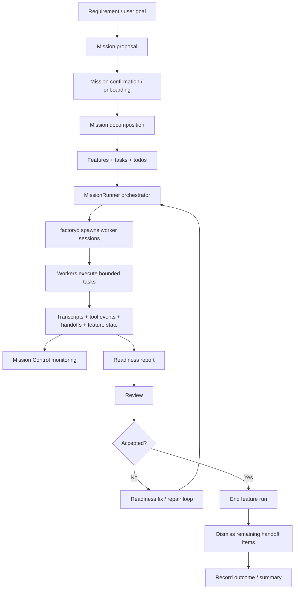

# Factory Mission Methodology

Date: 2026-03-09

## Purpose

This document distills the reverse-engineered Droid CLI findings into a practical methodology:

1. how requirements appear to be broken down
2. how execution appears to be structured
3. how monitoring appears to work
4. how deliverables appear to be evaluated
5. what design patterns are worth reusing

This is based on the installed Droid CLI binary and its embedded internal module names, plus the public `droid` help output.

## Executive Model

Factory's mission system appears to follow this core pattern:

1. convert user intent into a structured mission
2. decompose the mission into features and tasks
3. execute those tasks through an orchestrator with worker sessions
4. capture transcripts, handoffs, and progress state while work is running
5. evaluate outputs through explicit readiness and review stages
6. loop failed work back into a repair path instead of treating execution as completion

That is the main idea: execution is only one stage in a larger delivery loop.

## 1. Requirement Breakdown Method

Based on embedded modules such as:

- `mission-decomposition`
- `propose-mission`
- `MissionProposalConfirmation`
- `MissionOnboardingModal`
- `taskToolManager`
- `taskToolDescription`
- `TaskTool`
- `TodoDisplay`
- `FeaturesView`
- `FeatureDetailView`

their requirement breakdown method appears to be:

1. accept a high-level user objective
2. turn it into a mission proposal
3. confirm or initialize the mission
4. convert that mission into a structured decomposition
5. represent the work as:
   - features
   - tasks
   - todos

### What this means in practice

They likely do not let the model jump straight from prompt to implementation. They insert a structuring phase first.

That phase seems to answer:

- what is the overall mission
- what major feature slices are inside it
- what tasks belong to each slice
- what operational todos or follow-ups are needed

### Reusable pattern

If you want to copy this approach, use a two-step planner:

1. `mission proposal`
   A concise restatement of the user’s goal, boundaries, and expected outcome.
2. `mission decomposition`
   A machine-readable object with:
   - feature groups
   - tasks per feature
   - dependencies
   - completion criteria
   - likely handoff points

## 2. Execution Method

Based on:

- `droid exec --mission`
- `factoryd`
- `MissionRunner`
- `missionRunnerOperations`
- `DroidProcessManager`
- `ManagedProcessImpl`
- `ACPDaemonAdapter`
- `JsonRpcProtocolAdapter`
- `SessionController`
- `ConversationStateManager`
- `AgentLoop`
- `ToolExecutor`

their execution model appears to be:

1. a mission starts in orchestrator mode
2. the orchestrator does not do all work itself
3. it spawns worker sessions through `factoryd`
4. workers execute concrete tasks
5. the orchestrator remains responsible for mission continuity and coordination

### What this implies

They appear to separate:

- planning / coordination
- implementation work
- process management
- tool execution control

That is important because it prevents one session from mixing every responsibility.

### Reusable pattern

Split execution into two roles:

1. `orchestrator`
   Responsible for:
   - deciding what to do next
   - assigning tasks
   - tracking completion
   - deciding when to repair or stop

2. `worker`
   Responsible for:
   - implementing a bounded task
   - reporting evidence
   - producing transcripts and outputs
   - handing back unresolved issues clearly

## 3. Monitoring Method

Based on:

- `MissionControlOverlay`
- `WorkersView`
- `SessionViewerView`
- `HandoffViewerView`
- `ActiveWorkerPreview`
- `readWorkerTranscript`
- `listRunningMissions`
- `loadMissionState`
- `transcriptSkeleton`
- `missionTokenUsage`
- `ToolExecutionItem`
- `UnifiedToolDisplay`

their monitoring model appears to include at least four layers.

### A. Worker monitoring

They appear to track:

- which workers exist
- which ones are active
- what each worker is currently doing

### B. Transcript monitoring

They appear to preserve and inspect worker transcripts, not just final outputs.

That matters because transcripts let the orchestrator or reviewer answer:

- what was attempted
- what failed
- where the worker got stuck
- whether the work was done for the right reason

### C. Handoff monitoring

The presence of `HandoffViewerView` and `dismiss-handoff-items` suggests they track unresolved items explicitly.

That likely includes:

- blockers
- unresolved edge cases
- follow-up work
- caveats that prevent closure

### D. Feature-progress monitoring

The feature views suggest they do not only track workers. They track mission progress in terms of deliverable structure:

- feature
- feature status
- feature detail
- probably linked tasks and outputs

### Reusable pattern

Do not monitor only process state.

Track at least:

1. worker state
2. task/feature state
3. transcript evidence
4. handoff items
5. resource usage such as token or cost budgets

## 4. Test and Evaluation Method

Based on:

- `agent-readiness`
- `readiness-fix`
- `readiness-report`
- `review`
- `review-message-generator`
- `ReviewOverlay`
- `end-feature-run`
- `outcome-recorder`
- `exec-summary`

their evaluation model appears to be explicit and staged.

### Readiness

The readiness modules suggest a formal gate that asks:

- is this output actually ready
- what is missing
- what should be fixed before it can be accepted

This is stronger than simply asking whether the command ran successfully.

### Review

The review modules suggest a second evaluation layer that may focus more on:

- change quality
- diff quality
- correctness
- instruction compliance
- deliverable completeness

### Repair loop

The existence of `readiness-fix` strongly suggests that failed evaluation is expected and first-class.

That means the system likely does not assume:

- worker finished = work accepted

Instead it likely works like:

1. worker produces output
2. system evaluates readiness
3. if not ready, system generates a fix-oriented follow-up
4. work re-enters execution

### Reusable pattern

Use two distinct gates:

1. `readiness gate`
   Ask whether the artifact is complete enough to move forward.

2. `review gate`
   Ask whether the artifact is high-quality and acceptable.

This keeps "done enough to continue" separate from "good enough to ship".

## 5. Deliverable Closure Method

The presence of:

- `end-feature-run`
- `dismiss-handoff-items`
- `outcome-recorder`

suggests they do not treat deliverables as closed merely because a worker stopped.

A feature appears to be closable only when:

- the feature run is explicitly ended
- handoff items are cleared or dismissed
- an outcome is recorded

### Reusable pattern

Add explicit closeout criteria:

1. output exists
2. readiness passed
3. review passed
4. handoffs resolved
5. outcome recorded

Without these, a system will accumulate silent incompleteness.

## Reconstructed Lifecycle

## The Important Design Patterns To Copy

## Pattern 1: Separate decomposition from execution

Do not let the executor invent task structure on the fly every time. Force a decomposition step first.

Why it matters:

- reduces drift
- creates stable work units
- improves observability
- makes repair loops possible

## Pattern 2: Separate orchestrator from workers

Use one controller for mission logic and separate workers for concrete execution.

Why it matters:

- cleaner coordination
- easier retries
- bounded worker scope
- better monitoring

## Pattern 3: Monitor transcripts, not just statuses

Keep and inspect detailed worker transcripts.

Why it matters:

- failures become diagnosable
- handoffs become concrete
- evaluation can use evidence, not guesswork

## Pattern 4: Track handoffs explicitly

Treat unresolved items as named objects, not buried comments in chat.

Why it matters:

- prevents silent incompleteness
- enables clean ownership transfer
- allows real closeout

## Pattern 5: Use readiness before review

Ask "is this ready?" before asking "is this good?".

Why it matters:

- avoids wasting review effort on obviously incomplete work
- gives a cleaner repair loop
- separates completeness from quality

## Pattern 6: Close features explicitly

A finished worker is not the same as a finished deliverable.

Why it matters:

- enforces closure discipline
- reduces abandoned partial work
- improves auditability

## How I Would Translate Their Method Into Your Own System

If you wanted to adopt the same method, I would model the core objects like this:

### Mission

- goal
- scope
- constraints
- acceptance criteria
- decomposition status
- run status

### Feature

- name
- description
- linked tasks
- deliverable criteria
- review status

### Task

- owner
- instructions
- dependencies
- evidence produced
- current status

### Handoff item

- source worker
- target owner
- issue / unresolved point
- recommended next action
- severity
- dismissal / resolution state

### Evaluation artifact

- readiness result
- review result
- reasons
- required fixes
- final disposition

## Bottom Line

The best way to understand their approach is:

- they treat delivery as a controlled workflow
- not as a single interactive chat

The core method is:

1. structure the mission
2. decompose the work
3. execute through orchestrated workers
4. monitor evidence continuously
5. evaluate explicitly
6. repair when evaluation fails
7. close only when the feature is actually complete

That is the part worth copying more than any specific UI or daemon detail.

## What Can Be Inferred About Prompting

There is evidence that Droid uses different prompt paths at different stages, but static reverse engineering does not recover the complete text of those prompts reliably.

What is directly supported by the binary:

- `src/services/mission/prompts.ts`
- `src/tools/executors/client/mission/propose-mission.ts`
- `src/tools/executors/client/mission/start-mission-run.ts`
- `packages/droid-core/src/prompts/agent-readiness.ts`
- `packages/droid-core/src/prompts/readiness-fix.ts`
- `src/services/review/review-message-generator.ts`
- `src/components/review/CustomInstructionsScreen.tsx`
- `src/components/review/PresetSelectionScreen.tsx`
- `src/components/review/CommitSelectionScreen.tsx`

That strongly suggests at least five prompt classes:

1. `mission proposal prompt`

Purpose:

- convert raw user intent into a structured mission
- clarify scope before execution starts
- likely collect or generate a mission summary, constraints, and high-level outcomes

2. `mission decomposition prompt`

Purpose:

- turn the mission into features, tasks, and todos
- decide what should be parallelized versus kept sequential
- likely produce the object that feeds orchestrator planning

3. `worker execution prompt`

Purpose:

- give a worker a bounded task with local context
- define what artifact or evidence the worker must return
- likely include task instructions, constraints, and handoff expectations

4. `readiness prompt`

Purpose:

- evaluate whether the output is complete enough to be reviewed or closed
- likely ask whether requirements were addressed, evidence exists, and obvious gaps remain

5. `review prompt`

Purpose:

- evaluate quality of the resulting change or deliverable
- likely compare output against selected commits, presets, and optional custom instructions

There is also strong evidence for a dedicated `repair prompt`:

- `readiness-fix`

That implies failures are not handled by rerunning the same generic worker prompt. They likely construct a targeted repair instruction from the readiness result.

## What Is Confirmed Versus Inferred

Confirmed:

- stage-specific prompt modules exist
- review supports `custom instructions`
- review supports `presets`
- review supports `commit selection`
- mission flow has proposal and start-run stages

Inferred:

- the exact wording of the system prompts
- the exact schema required from each stage
- whether prompt text is fully static, partially generated, or assembled from templates

## Practical Conclusion

Yes, prompting appears to be stage-specific.

But from the current static binary inspection, what we can recover confidently is the prompt architecture, not the full prompt text.

To determine the actual prompt bodies, the next useful step would be runtime interception during:

- mission proposal
- worker spawn
- readiness evaluation
- review generation

That would likely require tracing the live session payloads or local session artifacts during a real `droid exec --mission` run.
