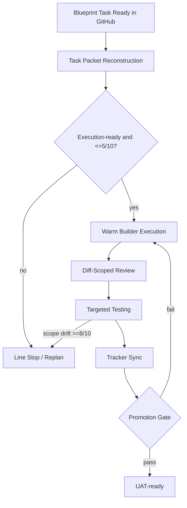

# pi-builder Build PRD

Source of truth: [GitHub Epic #2](https://github.com/Holovkat/pi-extensions/issues/2)

## Summary

Build `pi-builder` as a new execution extension derived from `pi-dev`. It consumes blueprint-published task state and runs a production-line execution model with:

- task-first intake
- runtime task-packet reconstruction
- warm builder continuity
- diff-scoped review
- layered targeted testing
- tracker sync back to GitHub
- promotion-gate handoff to UAT-ready output
- line-stop and replanning behavior for blocked or oversized work

## Problem

`pi-dev` is currently epic-first and checklist-first. The new execution flow must be task-first and reconstructable from GitHub issue state so execution can restart safely without private durable state.

## Goals

1. Create `pi-builder` as a separate extension alongside `pi-dev`
2. Start work only when a blueprint task is execution-ready and within execution complexity limits
3. Keep the same builder warm through correction loops
4. Review and test changed surfaces first, not the whole epic by default
5. Post major execution transitions back to GitHub issues
6. Escalate missing prerequisites and high scope drift back to replanning

## Non-Goals

- Redesign the dashboard or control centre
- Replace `pi-dev` in place on the first pass
- Force broad UAT on every local correction loop

## Target Flow

## Functional Requirements

### 1. Separate Extension Entrypoint
- `extensions/pi-builder.ts` exists alongside `extensions/dev-pipeline.ts`
- `pi-builder` identifies itself as the production-line execution engine
- legacy `pi-dev` flows remain available during migration

### 2. Task-First Intake
- execution starts from a task issue, not an epic loop
- the task issue is the stable spec source of truth
- issue comments and labels are the execution history

### 3. Runtime Task-Packet Reconstruction
Every packet must declare:
- `task_id`
- `issue_refs`
- `goal`
- `owned_files`
- `input_contracts`
- `output_contracts`
- `required_schema`
- `required_test_data`
- `required_artifacts`
- `preload_steps`
- `fixture_locations`
- `validation_scope`
- `regression_surface`
- `blockers`
- `lessons_learned`
- `next_lane`
- `line_stop_conditions`
- `expected_output`

Packet reconstruction must come from:
- issue body
- issue comments
- checklist state when available
- current git diff/repo state

### 4. Execution-Readiness Gate
- task must be execution-ready before build starts
- missing prerequisites must block execution and route back to replanning
- tasks above complexity `5/10` must not start

### 5. Warm Builder Continuity
- the same `dev` session should be reused across build, review-fix, and test-fix loops
- small corrections should use narrow correction packets instead of cold restarting the whole task

### 6. Diff-Scoped Review
- default review surface is changed files, touched interfaces, and acceptance criteria
- review findings must be structured and machine-usable

### 7. Layered Targeted Testing
Testing order:
1. changed-file checks
2. task acceptance checks
3. selected regression coverage
4. broader UAT only at promotion gates

### 8. Tracker Sync
Major transitions must be written back to GitHub:
- task intake
- line-stop/blocker state
- review/test findings
- promotion-gate decision
- UAT-ready handoff

### 9. Line Stop / Replanning
Builder must stop cleanly for:
- missing prerequisites
- execution overruns
- planning-grain failures
- scope-drift events at `8/10` or higher

## Acceptance Criteria

- `pi-builder` exists as a separate extension alongside `pi-dev`
- execution begins only for blueprint tasks that are execution-ready and `<=5/10` complexity
- review and test run on changed surfaces first, with broader promotion gates later
- GitHub issue/comment state is sufficient to reconstruct task context after restart
- `8/10+` scope-drift events are treated as red-flag planning failures and route back to replanning
