# Pi-Dev Production Line Whitepaper

## Reframing `pi-blueprint` and `pi-builder` as a GitHub-Backed Delivery Line

**Audience:** operator / workflow architect
**Scope:** define `pi-blueprint` and `pi-builder` as new extensions built from the current `pi-req` and `pi-dev` foundations, reducing churn, repeated code rereads, and phase-to-phase relearning while keeping the repository, issues, and checklist as the only durable source of truth.

---

## Executive Summary

The current `pi-dev` pipeline has the right raw primitives to serve as the foundation for `pi-builder`:

- RPC agent steering
- session reuse support
- GitHub issue integration
- watchdog yield summaries
- review and UAT gates

But the execution model is still too phase-shaped.

It behaves like:

1. build broad scope
2. stop
3. reread
4. review broadly
5. stop
6. reread
7. test broadly
8. stop
9. rewrite instructions
10. repeat

That produces the same core problem you already see elsewhere:

- code is reread too often
- intent is reconstructed too often
- later phases rediscover what earlier phases already knew
- each correction step pays too much startup cost

The fix is not a smarter prompt alone.

The fix is to turn `pi-blueprint` and `pi-builder` into a production line:

- GitHub issues remain the source of truth
- planning decides execution grain before work starts
- each task has a stable issue-backed execution packet
- builders stay warm across corrections
- reviewers and testers work from diffs and acceptance criteria, not from whole-repo reinterpretation
- every phase writes back to GitHub immediately so restart state comes from repo truth, not sidecar truth

The result is:

- less churn
- less repo rereading
- faster correction loops
- better prerequisite control
- clearer operator visibility

---

## Key Correction: Epics Are Delivery Containers, Not Build Units

An epic should not normally be the thing a builder agent attempts in one shot.

For a real system such as an ERP:

- the application is the whole program
- major domains such as invoicing, purchasing, inventory, CRM, and payroll are capability areas
- each domain contains phases or streams
- each phase contains epics
- each epic contains tasks
- each task may decompose into atomic steps

So the purpose of an epic is:

- scoping
- sequencing
- grouping
- progress tracking
- integration planning

Not:

- one-shot construction

That means planning has to determine execution grain before implementation starts.

---

## Current Problem

## What `pi-dev` Does Well Today

`pi-dev` already has:

- dual execution modes
- session reuse support
- GitHub learning comments
- steerable RPC agents
- watchdog timers and yield summaries
- review and UAT gates

Those are strong building blocks.

## Where It Still Burns Time

The current fast-track path is still structurally:

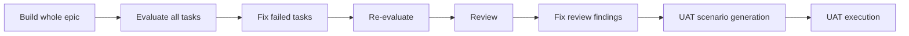

That creates five forms of waste:

### 1. Scope waste

Building an entire epic in one prompt is efficient only when the epic is unusually small and coherent.

### 2. Context reconstruction waste

Reviewers and testers rediscover:

- what the task meant
- which files matter
- what already changed
- what was intentionally deferred
- what prior attempts already tried

### 3. Validation shape mismatch

Implementation happens at task granularity, but evaluation often happens at epic or phase granularity.

### 4. Planning under-specification

The line often discovers too late that:

- a task is too broad
- a prerequisite is missing
- a dependency is downstream
- the execution unit was chosen badly

### 5. Sync friction

If the operator wants GitHub and the repo to remain authoritative, every meaningful phase result must be written back cleanly and consistently.

---

## Design Principles

This redesign assumes one hard rule:

> The repo, GitHub issues, checklist, and PR history are the only durable source of truth.

Everything else is derived and disposable.

### Principle 1: GitHub is the persistent state boundary

Persist in:

- issue body
- issue comments
- issue labels and state
- checklist updates
- PR descriptions and review comments

### Principle 2: Warm execution, cold oversight

The builder should stay warm.

The reviewer and tester can be stateless if they receive a precise task packet reconstructed from GitHub and the current diff.

### Principle 3: Task-first, not phase-first

The unit of flow should be the task or sub-task, not the epic.

### Principle 4: Plan the execution grain explicitly

Before implementation begins, planning must decide whether the work item is:

- epic-level planning only
- task-level execution ready
- sub-task execution ready
- atomic-step execution ready

### Principle 5: Narrow checks before broad checks

Use layered gates:

1. changed-file checks
2. task acceptance checks
3. epic integration checks
4. milestone UAT

### Principle 6: Findings must be machine-usable

Review and test outputs should be structured enough that:

- a sync skill can post them to GitHub
- a builder can consume them directly
- restart logic can reconstruct the task packet from the issue thread

---

## Planning Hierarchy

The workflow should explicitly model a hierarchy such as:

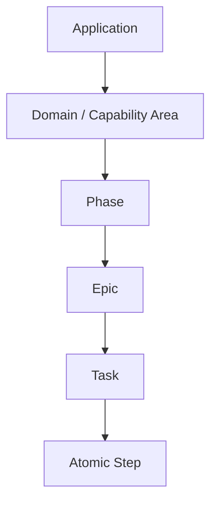

Example for ERP:

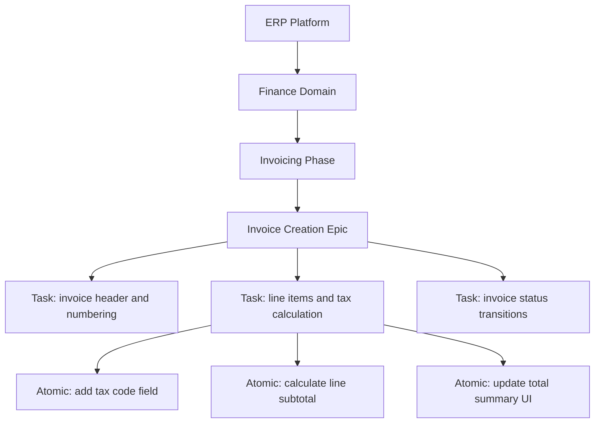

This is the right level for planning to decide how work enters the line.

---

## Complexity Scoring and Execution Grain

Use a ten-to-one scale:

- `10` is epic-sized or highly complex work
- `1` is an atomic change

The planner should assign a complexity score before execution and use that score to choose:

- execution shape
- expected duration
- prerequisite strictness
- review depth
- testing depth
- whether the line can continue or must stop and decompose

## Suggested Complexity Model

### Score 10

- epic-level
- not execution-ready
- must be decomposed before entering the line

### Score 8-9

- large task cluster
- may require parallel sub-tasks
- not execution-ready
- must be decomposed before any item enters implementation

### Score 6-7

- normal implementation task candidate
- not execution-ready until decomposed below the hard score ceiling

### Score 4-5

- focused sub-task
- limited file ownership
- execution-ready when prerequisites are clean and scope remains narrow

### Score 2-3

- small corrective action
- narrow patch
- should often bypass broad planning and use an accelerated fix lane

### Score 1

- atomic step
- tiny isolated change
- should be executable with almost no orchestration overhead

## What Planning Must Infer From the Score

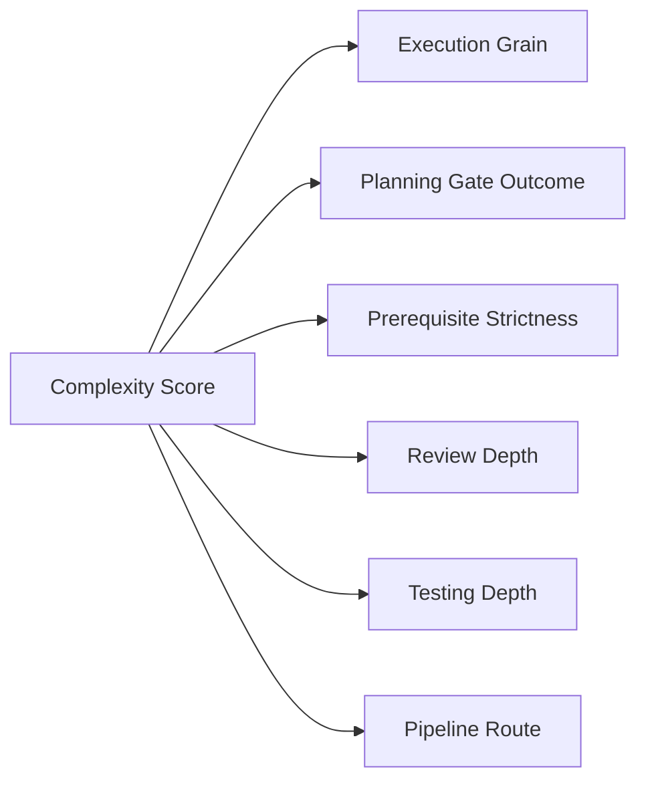

Planning becomes operational, not merely descriptive.

---

## Prerequisite Planning

A task should only enter the line if its prerequisites are satisfied or intentionally waived.

Each task needs explicit prerequisite metadata:

- required upstream tasks
- required services or infrastructure
- required schema or API contracts
- required foundation components
- required test fixtures or data shape

## Prerequisite Gate

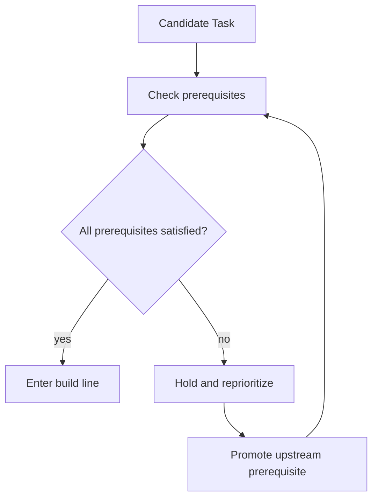

Instead of simply saying "next task", planning should ask:

- what must exist first?
- what foundation is missing?
- what should move up in priority?
- is the current task too broad or blocked to run efficiently?

---

## Blueprint Planning Model

Your construction metaphor is exactly the right planning frame.

The plan should classify work as:

- foundations
- structural frame
- systems and services
- enclosure and interface layers
- fit-out or workflow completion
- finish and verification

For software, that maps cleanly:

### Foundations

- data models
- auth model
- app shell
- routing skeleton
- shared UI primitives
- service manifests

### Structural Frame

- domain modules
- core state and event flow
- shared contracts
- integration boundaries

### Cladding / Outer Shell

- page composition
- user-facing workflows
- dashboards
- reports

### Fit-Out

- workflow edge cases
- policy logic
- operational tooling
- usability refinements

### Finish and Verification

- review
- targeted regression
- UAT
- operator acceptance

## Blueprint Diagram

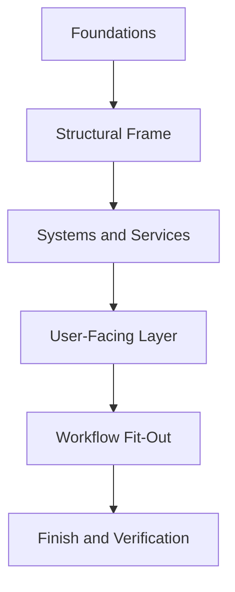

Planning should decide which layer each task belongs to and should resist scheduling downstream work before upstream structure exists.

---

## Planning as a Scheduling Engine

Planning should not just decompose work.
Planning should schedule the line.

It should know:

- what can run now
- what is blocked
- what should be decomposed further
- what should be escalated in priority
- what lane a task belongs in

## Scheduling Lanes

### Lane A: Foundation Lane

- schema
- core contracts
- infrastructure
- shared platform primitives

### Lane B: Feature Construction Lane

- standard implementation tasks

### Lane C: Correction Lane

- review-driven fixes
- test-driven fixes
- missed acceptance work

### Lane D: Verification Lane

- targeted regression
- epic integration tests
- milestone UAT

## Scheduling Diagram

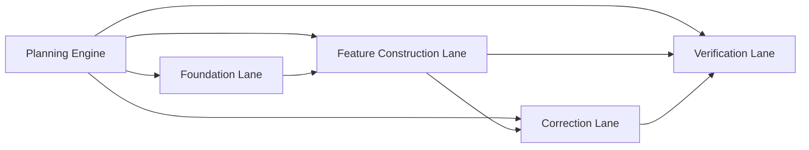

This is how the line stops feeling like a single queue.

---

## Complexity Gating and Line Stops

If a task reveals more scope than its score band allows, the line should stop, ask why, and potentially reprioritize prerequisites or decompose the work.

## Proposed Complexity Policy

Each score band gets a hard gating rule, not a soft timing target.

| Score | Typical Unit | Execution Status | Required Action |
|------|--------------|------------------|-----------------|
| 10 | epic | not executable | decompose |
| 8-9 | large task cluster | red-flag complexity creep | redesign or decompose |
| 6-7 | normal task | split-required | reject and split |
| 4-5 | focused sub-task | execution-ready | proceed if prerequisites are clean |
| 2-3 | small fix | fast corrective | direct correction path |
| 1 | atomic | atomic-ready | patch directly |

Hard rules:

- no execution-ready task should score above `5/10`
- anything scoring above `5/10` is rejected in planning and must be decomposed further
- anything scoring at `8/10` or higher is a red-flag signal of complexity creep or planning failure
- `8/10+` is not normal overrun tolerance; it is evidence the task entered the line at the wrong grain

## Line Stop Logic

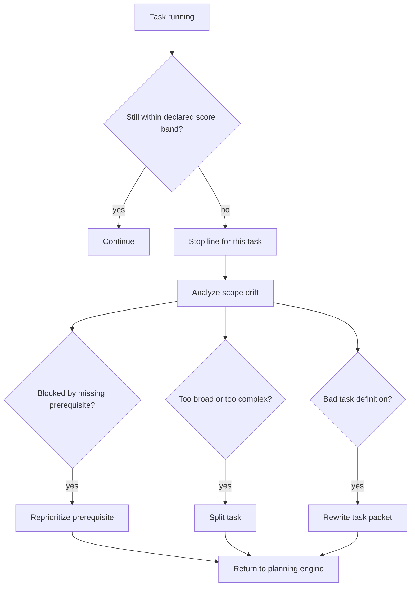

That is production-line behavior.

The system does not just keep chiseling. It stops and changes the plan.

---

## Target Architecture

## Overview

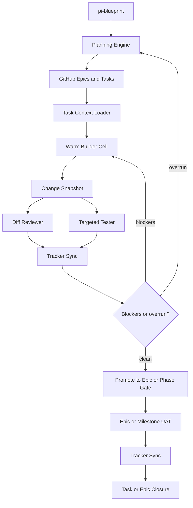

## Roles

### 1. `planning-engine`

Purpose:

- decides execution grain
- scores complexity
- verifies prerequisite readiness
- routes work to the right lane
- handles line-stop replanning

### 2. `task-context-loader`

Purpose:

- reconstructs the live task packet from GitHub and repo state

Reads:

- issue body
- parent epic issue
- checklist entry
- latest task comments
- recent review/test comments
- current changed files and diff

Produces:

- a live task packet for the builder, reviewer, or tester

This packet is ephemeral. It is not a new source of truth.

### 3. `builder-cell`

Purpose:

- owns a task from first implementation through correction loops

Properties:

- long-lived session
- stable task ownership
- carries local working context
- consumes correction packets instead of re-reading the full issue every round

### 4. `diff-reviewer`

Purpose:

- reviews changed surfaces plus declared interfaces

Its input should include:

- task packet
- diff summary
- files changed
- acceptance criteria
- declared owned files

### 5. `targeted-tester`

Purpose:

- runs the smallest meaningful check set first

Test modes:

- changed-file lint and type checks
- targeted unit or integration tests
- acceptance-specific runtime checks
- only later: epic-wide or milestone-wide UAT

### 6. `tracker-sync`

Purpose:

- writes every significant state transition back to GitHub or checklist artifacts

It should own:

- implementation status comments
- review findings comments
- test results comments
- issue labels
- checklist updates
- parent epic progress updates

### 7. `uat-runner`

Purpose:

- executes scenario-based validation only when the task or epic is truly ready

This should not be in the hot loop for every local fix.

---

## Core Data Model

## Task Packet

This packet is derived from GitHub and repo state at runtime.

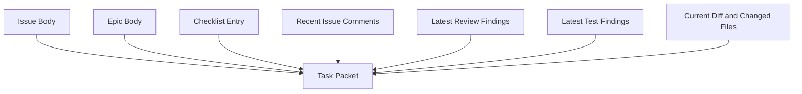

Suggested shape:

```json
{
  "taskId": "4.2",
  "issueNumber": 58,
  "title": "A* pathfinding",
  "parentEpic": 14,
  "complexityScore": 6,
  "planningGate": "rejected-decompose",
  "lane": "blocked-replan",
  "requirements": ["...", "..."],
  "acceptanceCriteria": ["...", "..."],
  "ownedFiles": ["src/pathfinding/*", "src/ghosts/blinky.ts"],
  "doNotTouch": ["src/ui/*"],
  "prerequisites": [
    {"id": "3.1", "status": "satisfied"},
    {"id": "3.4", "status": "missing"}
  ],
  "knownLearnings": [
    {
      "source": "issue-comment",
      "kind": "prior-fix-attempt",
      "summary": "Boundary detection rewrite already tried and failed"
    }
  ],
  "currentDiff": {
    "filesChanged": ["src/pathfinding/a_star.ts"],
    "baseCommit": "abc123"
  },
  "openFindings": [
    {
      "source": "review",
      "severity": "high",
      "file": "src/pathfinding/a_star.ts",
      "issue": "heuristic not admissible in tunnel cases"
    }
  ]
}
```

Again: this is reconstructed, not persisted as a separate truth store.

## Comment Schema

To make restart and continuation cheap, GitHub comments should become structured.

### Implementation Comment

```markdown
## Implementation Update
Task: 4.2
Status: in_progress
Complexity: 6
Lane: feature-construction
Files Changed:
- src/pathfinding/a_star.ts
- src/pathfinding/grid.ts

Acceptance Criteria Touched:
- AC1
- AC3

Notes:
- Added tunnel-aware neighbor expansion
- Did not touch ghost targeting yet
```

### Review Comment

```markdown
## Review Findings
Task: 4.2
Status: fail

Blockers:
- [high] src/pathfinding/a_star.ts:214 heuristic violates expected monotonic behavior in wrap tunnel

Non-blockers:
- [medium] src/pathfinding/grid.ts:88 duplicated coordinate conversion logic

Recommended Next Step:
- Keep builder session hot and patch heuristic logic only
```

### Test Comment

```markdown
## Test Results
Task: 4.2
Status: fail

Checks Run:
- npm test -- src/pathfinding/a_star.test.ts
- npm run typecheck

Failures:
- tunnel wrap case returns path length 19 instead of expected 11

Regression Status:
- unrelated movement tests not run in this pass
```

These become durable restart anchors.

---

## Redesigning `pi-blueprint`

Greenfield projects are won or lost in planning quality.

Today `req-qa` is an interview and specialist consultation loop. `pi-blueprint` should inherit that foundation, but go further and produce build-ready task packets, not just a PRD plus checklist.

## What `pi-blueprint` Should Add

### 1. Implementation-ready acceptance criteria

Every task should exit planning with:

- user-visible outcome
- technical boundaries
- owned files or modules
- likely test strategy
- explicit non-goals

### 2. Dependency graphing

Tasks should explicitly state:

- prerequisite tasks
- parallel-safe tasks
- blocking interfaces

### 3. Verification design during planning

Each task should already have:

- unit or integration expectation
- acceptance test candidate
- UAT relevance

### 4. Build packet quality scoring

Before task creation, `pi-blueprint` should run a planning quality gate:

- is the task scoped enough?
- is ownership clear?
- is the test strategy obvious?
- can it be executed independently?

### 5. Complexity scoring

`pi-blueprint` should score each work item from `10` to `1` and determine:

- whether it is executable yet
- whether it must be decomposed
- what lane it belongs in
- what planning gate status it receives
- what prerequisites must be proven first

### 6. Prerequisite enforcement

Planning must explicitly mark:

- prerequisites satisfied
- prerequisites missing
- prerequisites waived by operator decision

If not, planning loops until the task is production-line ready.

## Improved `pi-blueprint` Flow

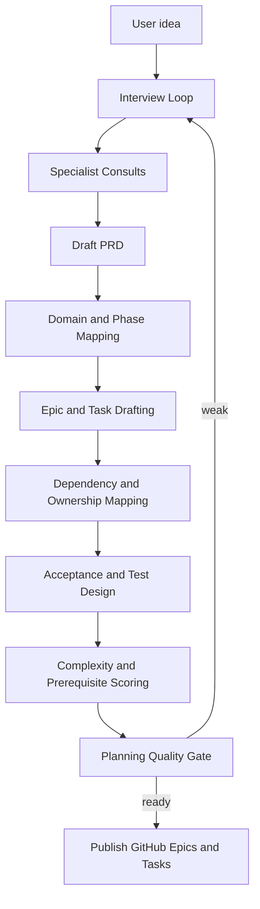

## `pi-blueprint` Deliverables for `pi-builder`

For each task, publish:

- problem statement
- desired outcome
- exact acceptance criteria
- ownership boundary
- known dependencies
- prerequisite state
- complexity score
- recommended execution lane
- suggested tests
- suggested UAT scenarios

That reduces later reinterpretation dramatically.

---

## Redesigning `pi-builder`

## New Flow

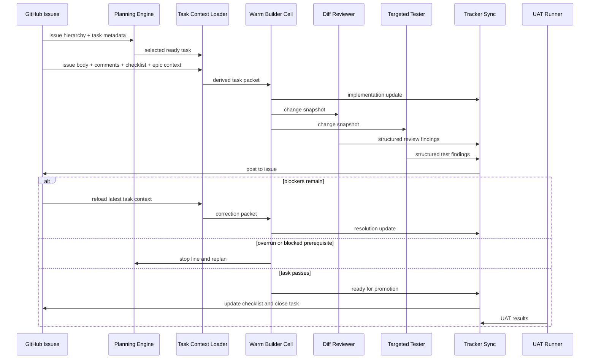

## What Changes in Practice

### Today

- build broad scope
- broad evaluation
- broad review
- broad fix
- broad retest

### Proposed

- execute small owned scope
- execute only tasks whose prerequisites are ready
- review only touched surfaces
- test only relevant surfaces first
- write findings to issue
- correct in the same warm builder session
- stop and replan when complexity or prerequisites were misjudged
- promote only when local acceptance is clean

This is the core production-line shift.

---

## Scenario 1: Greenfield Project End to End

## Goal

Take a new product from idea to shipped first version using `pi-blueprint` and `pi-builder`.

## Recommended Flow

### Phase A: Discovery and build planning in `pi-blueprint`

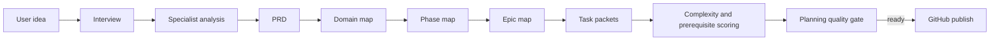

### What changes from current behavior

`pi-blueprint` should not stop at a nice PRD.

It should produce:

- domain map
- phase map
- epics with dependencies
- tasks with owned files or modules
- acceptance criteria that can be scored
- complexity score per work item
- prerequisite status per work item
- test strategy hints
- UAT candidates

### Example

Suppose the project is a greenfield ERP slice for invoicing:

- Domain: finance
- Phase: invoicing foundations
- Epic 1: invoice data model and numbering
- Epic 2: invoice editor workflow
- Epic 3: tax calculation and totals
- Epic 4: posting, status transitions, and printable output

Each task should already say:

- what files or domains it likely owns
- what it must not modify
- how acceptance will be checked
- what must exist first
- whether it is build-ready now or held for a prerequisite

## Execution in `pi-builder`

For each task:

1. planning engine selects only a ready task whose prerequisites are satisfied
2. `task-context-loader` reconstructs task state from GitHub
3. `builder-cell` owns it through implementation and corrections
4. `diff-reviewer` checks changed files and declared interfaces
5. `targeted-tester` runs the minimum meaningful validation set
6. `tracker-sync` posts results
7. if clean, task is closed and epic progress updates
8. only at epic completion does broader integration validation run

## Why this is better for greenfield

Greenfield work tends to drift because planning is too high level and implementation is too broad.

This redesign fixes that by making planning output buildable units rather than narrative documentation.

---

## Scenario 2: Enhancements From Review Planning to UAT

## Goal

Add new capability to an existing product where review concerns and regression risk matter.

## Recommended Flow

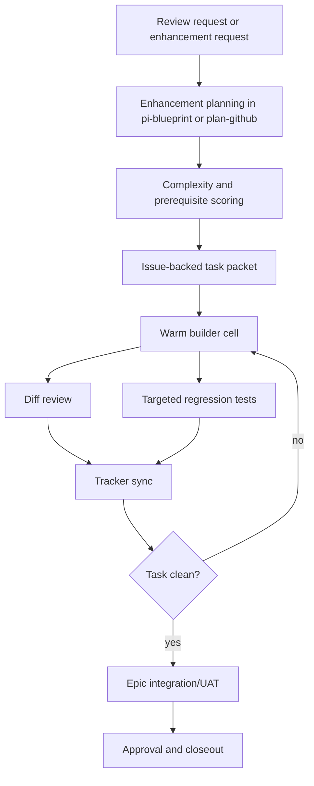

## Example

An existing onboarding flow needs:

- a new invitation step
- revised email templates
- an extra validation state

Under the current broad phase model, this often causes:

- too much rereading of unrelated onboarding code
- broad review passes over the whole flow
- test generation that does not distinguish changed from unchanged surfaces

Under the production-line model:

- planning decides if the enhancement is one task or multiple sub-tasks
- the task packet clearly states touched surfaces
- review looks at those surfaces plus dependent interfaces
- tests run targeted cases first
- only later does UAT validate the end-to-end onboarding flow

## Why this is better for enhancements

Enhancements succeed when change scope stays narrow.

The pipeline should preserve that narrowness instead of widening the scope again at each gate.

---

## Scenario 3: Bug Fixes From Root Cause to Regression Testing

## Goal

Handle bug fixes without bouncing between vague hypotheses, broad rebuilds, and expensive retesting.

## Recommended Flow

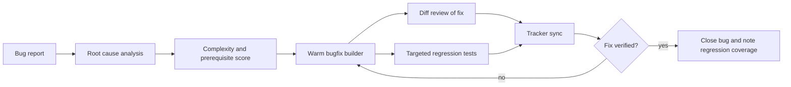

## What changes from current behavior

Bugfixes should get a dedicated flow:

### Step 1: root cause packet

Planning should produce:

- observed symptom
- confirmed root cause
- affected files and modules
- regression surface
- complexity score
- whether the fix is atomic or should be split

### Step 2: hot bugfix cell

The same builder session that found the root cause should usually implement the fix.

Do not hand the problem to a cold downstream agent unless the builder yields or the bug spans multiple domains.

### Step 3: targeted regression tests

Run:

- the failing test or reproduction first
- the directly adjacent regression set second
- only then broader validation if risk warrants it

## Example

A bug in a scoring system destroys a score label on game start.

A marble-carving pipeline does this:

- review finds symptom
- bugfix agent rereads everything
- tester retests too broadly
- reviewer restates what the builder already knew

A production-line pipeline does this:

- root cause packet says: `startGame()` destroys all `Text` objects
- builder patches only label lifecycle
- reviewer checks UI object ownership and lifecycle scope
- tester runs targeted regression for score visibility and score updates
- issue comment records exact regression coverage

## Why this is better for bugfixes

Bug fixes are where context continuity matters most.

If the agent that understands the root cause can stay hot through the fix loop, cycle time drops sharply.

---

## Operating Model by Workflow Type

## Greenfield

- strongest investment in `pi-blueprint`
- task packet quality determines downstream speed
- broader integration tests happen at epic boundaries

## Enhancements

- strongest investment in scope control
- diff review and targeted regression provide most of the speedup

## Bugfixes

- strongest investment in root cause packet quality
- warm builder continuity is most important here

---

## Skills To Add

### `planning-engine`

For all workflows:

- assigns complexity score
- validates prerequisite readiness
- chooses execution lane
- chooses planning gate outcome
- decides when a work item must be decomposed before entering the line

### `task-context-loader`

Reads:

- issue body
- parent epic
- checklist state
- recent comments
- latest diff

Returns:

- derived task packet

### `tracker-sync`

Posts:

- implementation updates
- review findings
- test results
- state transitions
- checklist changes

Use GitHub CLI or SDK, whichever is less painful and more reliable in the environment.

### `diff-reviewer`

Focus:

- changed files
- touched interfaces
- real blockers only

### `targeted-tester`

Focus:

- changed-file checks
- targeted regression selection
- acceptance-specific tests

### `root-cause-analyst`

For bug workflows:

- convert symptoms into a root cause packet
- define regression surface

### `uat-promoter`

Purpose:

- decide whether a task or epic is ready to enter UAT
- prevent expensive UAT from becoming a hot-loop default

---

## Where `pi-blueprint` Needs To Improve

### 1. Better task detail

Tasks must be:

- smaller
- more independently executable
- more explicit about ownership

### 2. Better verification design

Each task should already name:

- expected validator type
- probable regression surface
- whether UAT is needed now or only at epic completion

### 3. Better dependency clarity

Every task should specify:

- hard blockers
- soft dependencies
- safe parallelism

### 4. Better execution-grain decisions

`pi-blueprint` must explicitly decide:

- is this still an epic?
- is this now a task?
- does this need to be split into sub-tasks?
- is this already atomic enough to execute?

That decision should not be left for the builder to discover expensively.

---

## Where `pi-builder` Needs To Improve

## Replace broad phase prompts with task packets

The task prompt should be reconstructed from GitHub and repo state, not freshly composed from broad pipeline prose each time.

## Keep builder sessions warm

The builder should persist across:

- build
- review-fix
- test-fix

It should not restart cold for every correction step.

## Make review and test diff-scoped first

Broad review and broad testing should be promotion gates, not default hot-loop behavior.

## Make GitHub synchronization a first-class skill

Do not rely on each phase agent to remember how to update issues well.

Use a dedicated sync role.

## Add a planning engine in front of execution

`pi-builder` should not simply take the next checklist item.

It should first ask:

- is this item build-ready?
- are its prerequisites satisfied?
- is it too large for the line?
- what lane should it enter?
- what planning gate result applies?

That is how the line becomes adaptive instead of procedural.

---

## Success Metrics

The redesign is working if you see:

- fewer full-repo rereads per task
- fewer repeated instructions across phases
- lower average correction cycle time
- fewer broad validator runs per local fix
- better GitHub issue state fidelity
- cleaner restart continuity from issue threads alone
- more correct line-stop decisions before wasted overrun

### Suggested KPIs

- average task completion time
- average number of corrective loops per task
- average number of builder cold starts per task
- average number of files reread per correction loop
- percentage of restarts successfully reconstructed from GitHub only
- UAT runs per epic versus per fix
- percentage of tasks stopped and replanned before wasted overrun
- percentage of tasks entering the line with prerequisites already satisfied
- average variance between planned score band and actual execution time

---

## Final Recommendation

The right direction for `pi-extensions` is:

- make `pi-blueprint` produce build-ready, complexity-scored task packets
- keep GitHub as the only durable workflow memory
- keep one warm builder cell per task
- make review and test narrow and structured
- use dedicated sync skills to continuously update GitHub and checklist state
- add a planning engine that decides execution grain, prerequisites, and lane routing before build starts
- enforce a hard complexity ceiling of `5/10` for any execution-ready task
- reserve broad UAT and broad validation for promotion points, not every local correction

That turns `pi-builder` from a sequence of fresh specialist passes into a true production line:

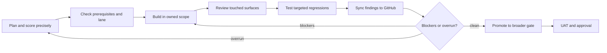

That is the practical path to making `pi-builder` feel less like carving marble and more like running a disciplined factory line.
