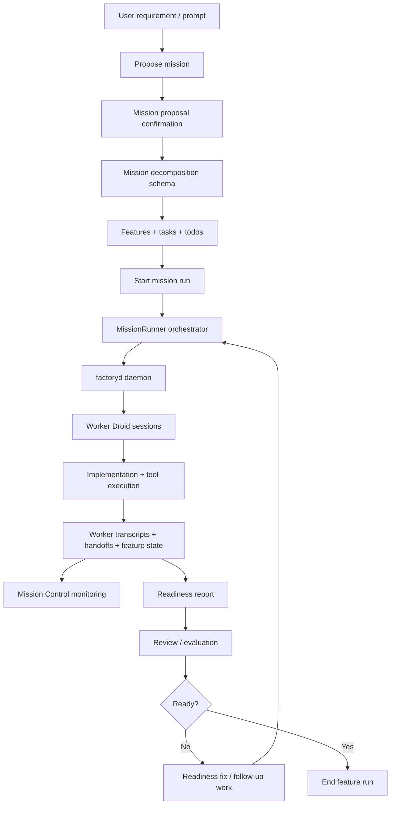

# Reverse Engineering: Droid CLI Delivery Lifecycle

Date: 2026-03-09

## Scope

This note reconstructs how the installed Droid CLI appears to handle:

1. requirements intake
2. task decomposition
3. tests / evaluation planning
4. execution
5. monitoring
6. final evaluation of deliverables

This is based on:

- public CLI help
- embedded module names and strings from `/Users/tonyholovka/.local/bin/droid`

## High-Level Answer

Droid does not look like a single-pass "prompt -> code" system.

It appears to use a staged delivery pipeline:

1. capture and confirm the mission
2. decompose the mission into structured tasks / features
3. start a mission run under an orchestrator
4. spawn worker sessions via `factoryd`
5. collect transcripts, handoffs, and intermediate outputs
6. run readiness / review style evaluation on outputs
7. either accept, fix, or hand off follow-up work

## Evidence by Stage

## 1. Requirements Intake

The binary contains these mission-entry and requirement-shaping modules:

- `src/commands/mission.ts`
- `src/commands/missions.ts`
- `src/commands/enter-mission.ts`
- `src/commands/exit-mission.ts`
- `src/components/MissionOnboardingModal.tsx`
- `src/components/MissionProposalConfirmation.tsx`
- `src/tools/executors/client/mission/propose-mission.ts`
- `src/components/tools/implementations/ProposeMissionTool.tsx`
- `packages/common/src/droid/schemas/mission-decomposition.ts`
- `src/services/mission/prompts.ts`

What that suggests:

- the system first turns user intent into a proposed mission
- there is likely a confirmation step in interactive mode
- the mission is not just free text; it is converted into a structured schema
- prompt templates for missions are separated into a dedicated mission prompt layer

Best inference:

- requirements are normalized into a "mission proposal"
- the proposal is probably turned into a decomposition object described by `mission-decomposition.ts`

## 2. Task Breakdown

The binary contains:

- `packages/common/src/droid/schemas/mission-decomposition.ts`
- `src/tools/descriptions/taskToolDescription.ts`
- `src/tools/managers/taskToolManager.ts`
- `src/components/tools/implementations/TaskTool.tsx`
- `src/components/TodoDisplay.tsx`
- `src/components/TodoItem.tsx`
- `src/utils/todo-utils.ts`
- `src/tools/executors/client/task-cli.ts`
- `src/tools/executors/client/todo-write-cli.ts`
- `src/components/mission-control/views/FeaturesView.tsx`
- `src/components/mission-control/views/FeatureDetailView.tsx`
- `src/tools/executors/client/mission/start-mission-run.ts`
- `src/components/tools/implementations/StartMissionRunTool.tsx`

What that suggests:

- decomposition produces explicit tasks and probably feature groupings
- there is both a task layer and a todo layer
- task execution is treated as a tool, not just hidden planner state
- features are a first-class aggregation above individual tasks

Best inference:

- requirements become a mission decomposition
- the decomposition is then represented as features + tasks + todos
- starting actual work is a separate explicit action: "start mission run"

## 3. Tests and Evaluation Planning

The binary contains:

- `packages/droid-core/src/prompts/agent-readiness.ts`
- `packages/droid-core/src/prompts/readiness-fix.ts`
- `packages/droid-core/src/api/readiness.ts`
- `src/commands/readiness-report.ts`
- `src/tools/executors/client/store-agent-readiness-report-cli.ts`
- `src/components/review/ReviewOverlay.tsx`
- `src/services/review/review-message-generator.ts`
- `src/commands/review.ts`
- `src/components/review/CommitSelectionScreen.tsx`
- `src/components/review/CustomInstructionsScreen.tsx`
- `src/components/review/PresetSelectionScreen.tsx`

What that suggests:

- evaluation is formalized as "readiness" and "review", not just ad hoc judgement
- there is likely a generated readiness report artifact
- readiness failures can feed into a dedicated "readiness-fix" loop
- review can be parameterized by preset, branch/commit selection, and custom instructions

Best inference:

- they likely separate:
  - execution of the work
  - readiness evaluation of whether the work is acceptable
  - review of the resulting change set / deliverable

## 4. Execution

The binary contains:

- `src/services/mission/MissionRunner.ts`
- `src/services/mission/missionRunnerOperations.ts`
- `src/controllers/SessionController.ts`
- `src/services/ConversationStateManager.ts`
- `src/core/AgentLoop.ts`
- `src/core/ToolExecutor.ts`
- `src/agent/tools.ts`
- `src/agent/tool-confirmation.ts`
- `src/agent/autonomy.ts`
- `packages/droid-sdk/src/DroidProcessManager.ts`
- `packages/droid-sdk/src/ManagedProcessImpl.ts`
- `packages/droid-sdk/src/process-transport.ts`
- `src/acp/ACPDaemonAdapter.ts`
- `src/acp/ChildProcessHandler.ts`
- `src/adapters/JsonRpcProtocolAdapter.ts`
- `src/exec/sharedAgentRunner.ts`
- `src/exec/acpDaemonRunner.ts`
- `src/exec/acpChildRunner.ts`

Public help also confirms:

- mission mode "spawns worker sessions via factoryd"
- mission mode upgrades the session into orchestrator mode

What that suggests:

- an orchestrator session owns the mission
- workers are separate managed sessions/processes
- process transport is abstracted, likely over ACP/JSON-RPC
- tool execution is centrally mediated, with autonomy and confirmation controls

Best inference:

- the orchestrator does not directly do all implementation itself
- it delegates tasks to managed worker sessions
- those workers run through a controlled tool-execution loop

## 5. Monitoring

The binary contains:

- `src/components/mission-control/MissionControlOverlay.tsx`
- `src/components/mission-control/views/MainView.tsx`
- `src/components/mission-control/views/WorkersView.tsx`
- `src/components/mission-control/views/ActiveWorkerPreview.tsx`
- `src/components/mission-control/views/SessionViewerView.tsx`
- `src/components/mission-control/views/HandoffViewerView.tsx`
- `src/components/mission-control/views/FeaturesView.tsx`
- `src/components/mission-control/utils/readWorkerTranscript.ts`
- `src/services/mission/listRunningMissions.ts`
- `src/utils/loadMissionState.ts`
- `src/services/mission/transcriptSkeleton.ts`
- `src/services/mission/missionTokenUsage.ts`
- `src/components/ToolExecutionItem.tsx`
- `src/components/UnifiedToolDisplay.tsx`
- `src/components/BackgroundTasksPanel.tsx`

What that suggests:

- monitoring is multi-layered:
  - mission-level status
  - worker-level status
  - session transcript inspection
  - handoff inspection
  - feature-level progress
  - tool execution visibility
  - token / cost visibility

Best inference:

- they monitor both process state and semantic work state
- monitoring is not only "is worker alive"
- it also includes:
  - what feature is being worked on
  - what handoffs exist
  - what tools were executed
  - what transcripts say
  - how much mission budget was consumed

## 6. Evaluation of Deliverables

The strongest evaluation-related modules are:

- `packages/droid-core/src/prompts/agent-readiness.ts`
- `packages/droid-core/src/prompts/readiness-fix.ts`
- `src/commands/readiness-report.ts`
- `src/services/review/review-message-generator.ts`
- `src/commands/review.ts`
- `src/tools/executors/client/mission/end-feature-run.ts`
- `src/tools/executors/client/mission/dismiss-handoff-items.ts`
- `packages/logging/src/outcome-recorder.ts`
- `src/exec/exec-summary.ts`

What that suggests:

- deliverables are evaluated at least twice:
  - readiness check
  - review check
- feature runs have explicit lifecycle closure
- handoff items can be dismissed separately from raw execution output
- outcomes are recorded as structured results, not just terminal text

Best inference:

- a deliverable probably passes through this decision chain:
  - did the worker finish
  - is the output ready
  - does review accept the result
  - are there unresolved handoff items
  - can the feature run be ended cleanly

## Reconstructed End-to-End Workflow

## Interpretation of Their Approach

The important pattern is this:

- requirements are not executed immediately
- they are converted into a mission artifact
- the mission artifact is decomposed into structured work units
- execution is delegated to workers under an orchestrator
- runtime monitoring and semantic monitoring happen in parallel
- deliverables are evaluated through explicit readiness/review stages
- failed evaluation appears to feed a repair loop instead of silently continuing

That is a more production-oriented workflow than a basic agent loop.

## Practical Summary

If you want to model their approach conceptually, it is closest to:

1. intake
2. structured decomposition
3. orchestrated execution
4. transcript + handoff based monitoring
5. readiness gate
6. review gate
7. repair or closeout

## Confidence Level

High confidence:

- mission mode uses an orchestrator plus worker sessions via `factoryd`
- mission control includes dedicated UI and mission runtime layers
- tasking, monitoring, readiness, and review are separate concerns

Medium confidence:

- exact ordering between readiness and review
- exact schema fields in mission decomposition
- exact criteria used in deliverable evaluation

Those last pieces would require either:

- live runtime tracing of a mission session, or
- access to the original TypeScript source rather than the bundled executable
