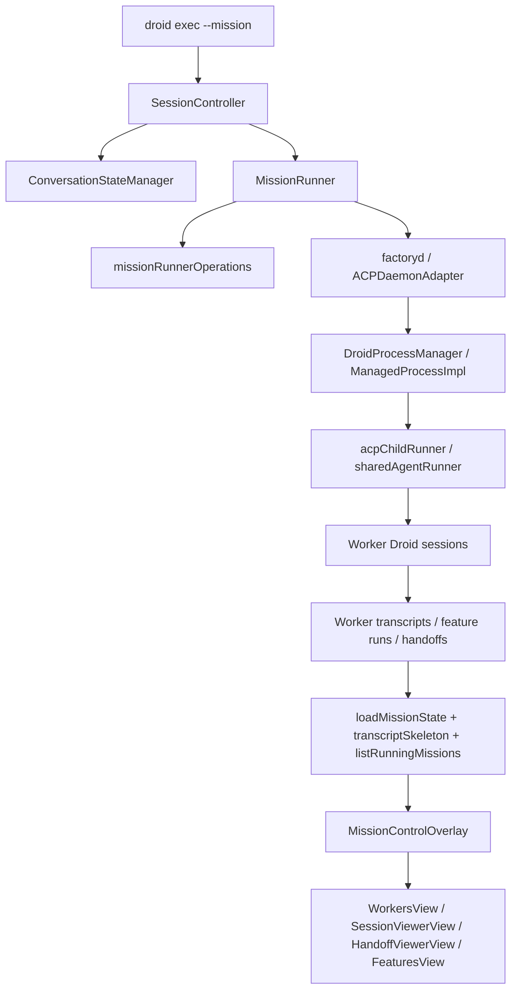

# Reverse Engineering: Droid CLI Mission Control

Date: 2026-03-09

## Scope

This note reverse-engineers the installed Droid CLI binary on this machine:

- `/Users/tonyholovka/.local/bin/droid`

The goal is to identify whether the binary contains a "mission control" path, how mission orchestration appears to work, and what parts are confirmed from the binary versus inferred from embedded source paths and CLI help.

## What the Binary Is

Confirmed from local inspection:

- The executable is a native `Mach-O 64-bit executable arm64`.
- It is signed by `Developer ID Application: The San Francisco AI Factory Inc. (SW6TL4V6Q5)`.
- It appears to be a Bun-compiled standalone executable carrying bundled JS/TS application code and runtime assets.

That matters because the binary is not opaque native-only code. It leaks a lot of internal source paths and feature names through embedded strings.

## Public CLI Surface Relevant to Missions

Confirmed from `droid --help` and `droid exec --help`:

- `droid exec --mission` is the public switch for multi-agent orchestration.
- Mission mode "automatically upgrades session to orchestrator mode".
- Mission mode "spawns worker sessions via factoryd to implement features".
- Mission mode requires `--auto high` or `--skip-permissions-unsafe`.
- `droid daemon` exists and is described as `Run the Factory daemon server`.
- `droid daemon` can bind on TCP or Unix socket and accepts `--droid-path <path>` "for spawning sessions".

The direct help text already confirms the high-level mission-control architecture:

1. `droid exec --mission` enables orchestrator mode.
2. Orchestrator mode uses `factoryd`.
3. `factoryd` is responsible for spawning sessions.

## Embedded Internal Modules Found in the Binary

The binary contains embedded source/module names that strongly map the internal mission stack:

### Mission and Mission Control UI

- `src/components/mission-control/MissionControlOverlay.tsx`
- `src/components/mission-control/views/MainView.tsx`
- `src/components/mission-control/views/WorkersView.tsx`
- `src/components/mission-control/views/SessionViewerView.tsx`
- `src/components/mission-control/views/HandoffViewerView.tsx`
- `src/components/mission-control/views/ActiveWorkerPreview.tsx`
- `src/components/mission-control/views/MissionModelsView.tsx`
- `src/components/mission-control/views/FeatureDetailView.tsx`
- `src/components/mission-control/views/FeaturesView.tsx`
- `src/components/mission-control/utils/readWorkerTranscript.ts`
- `src/components/MissionOnboardingModal.tsx`
- `src/components/MissionsList.tsx`
- `src/components/MissionModeModelPicker.tsx`

This is the clearest evidence that "Mission Control" is a first-class product surface inside Droid itself, not a sidecar name.

### Mission Runtime

- `src/services/mission/MissionRunner.ts`
- `src/services/mission/missionRunnerOperations.ts`
- `src/services/mission/prompts.ts`
- `src/services/mission/transcriptSkeleton.ts`
- `src/services/mission/listRunningMissions.ts`
- `src/services/mission/missionTokenUsage.ts`
- `src/utils/loadMissionState.ts`

These names strongly suggest a stateful mission orchestrator with persisted mission state, transcript assembly, running-mission enumeration, and mission-specific token accounting.

### Mission Tooling Hooks

- `src/tools/executors/client/mission/propose-mission.ts`
- `src/tools/executors/client/mission/start-mission-run.ts`
- `src/tools/executors/client/mission/end-feature-run.ts`
- `src/tools/executors/client/mission/dismiss-handoff-items.ts`
- `src/components/tools/implementations/ProposeMissionTool.tsx`
- `src/components/tools/implementations/StartMissionRunTool.tsx`
- `src/components/tools/special/ProposeMissionDisplay.tsx`

These names imply that mission lifecycle is not only a CLI flag but also represented as first-class tools/actions inside the Droid agent loop and TUI.

### Process / Session / Daemon Transport

- `packages/droid-sdk/src/DroidProcessManager.ts`
- `packages/droid-sdk/src/ManagedProcessImpl.ts`
- `packages/droid-sdk/src/process-transport.ts`
- `src/acp/ACPDaemonAdapter.ts`
- `src/acp/ACPAdapter.ts`
- `src/acp/ChildProcessHandler.ts`
- `src/adapters/JsonRpcProtocolAdapter.ts`
- `src/adapters/AcpProtocolAdapter.ts`
- `src/exec/acpDaemonRunner.ts`
- `src/exec/acpChildRunner.ts`
- `src/exec/sharedAgentRunner.ts`
- `src/controllers/SessionController.ts`
- `src/services/ConversationStateManager.ts`

This set is the strongest evidence for how missions are actually wired internally:

- there is a process manager
- there is a daemon adapter
- there is a child-process handler
- there is a JSON-RPC protocol adapter
- there is a session controller

## Confirmed Runtime Topology

From the CLI help and daemon help, the following is confirmed:

What is confirmed here:

- the CLI enters mission mode
- mission mode uses orchestrator mode
- orchestrator mode spawns worker sessions
- worker sessions are spawned via `factoryd`

## Best-Effort Internal Flow Reconstruction

The binary strongly suggests this more detailed flow:

## What Is Confirmed vs Inferred

### Confirmed

- Mission mode exists publicly: `droid exec --mission`.
- Mission mode is multi-agent orchestration.
- Mission mode upgrades the session into orchestrator mode.
- Mission mode uses `factoryd`.
- `factoryd` is a daemon server that spawns sessions.
- The binary includes explicit internal modules named `MissionControlOverlay`, `MissionRunner`, `DroidProcessManager`, `ManagedProcessImpl`, `ACPDaemonAdapter`, `JsonRpcProtocolAdapter`, and mission tool executors.

### Inferred

- The orchestrator likely talks to workers through an ACP/JSON-RPC process transport rather than ad hoc shell piping.
- `factoryd` likely owns mission worker lifecycle, session registration, and reconnectable process management.
- Mission Control likely visualizes:
  - running workers
  - mission features / feature runs
  - worker transcripts
  - handoff items between workers and orchestrator
  - mission model selection
- Mission proposal and mission run start are likely tool-mediated inside the main agent loop, not only CLI argument toggles.

These inferences are high-confidence because the binary contains the exact module names for each of those responsibilities, but they are still inferences because we do not have the original TypeScript source in the current workspace.

## Most Important Architectural Finding

The key path is probably:

1. `droid exec --mission` starts an orchestrator session.
2. The orchestrator delegates mission execution to `MissionRunner`.
3. `MissionRunner` uses `factoryd` through an ACP daemon adapter.
4. `factoryd` spawns and manages worker Droid sessions.
5. Session/process state is handled by `DroidProcessManager`, `ManagedProcessImpl`, and process transport adapters.
6. Mission outputs are persisted as transcripts / state / handoff data.
7. Mission Control UI surfaces that data through overlay and viewer components.

That means the reusable integration seam is probably not the TUI overlay itself. It is the daemon + process-manager + transport layer underneath it.

## Secondary Finding: Mission Control Is Not Just UI

The mission-related UI names could have been misleading on their own, but the binary also includes:

- mission runner services
- mission state loaders
- worker transcript readers
- process managers
- daemon adapters
- session controllers

So "Mission Control" appears to be a full subsystem with:

- orchestration
- worker management
- transcript/handoff persistence
- UI inspection and control

not just a visual dashboard.

## Practical Reuse Path

If the goal is to "utilize the path or methods they used for mission control processes", the likely path to reuse is:

1. Use `droid exec --mission` as the supported entrypoint for orchestrated work.
2. Treat `factoryd` as the worker-session control plane.
3. Look for daemon/session transport behavior around:
   - `DroidProcessManager`
   - `ManagedProcessImpl`
   - `process-transport`
   - `ACPDaemonAdapter`
   - `JsonRpcProtocolAdapter`
4. Treat mission state and transcript handling as a separate layer from process execution.
5. Treat Mission Control UI as a consumer of mission state, not the source of orchestration.

## Limits of This Reverse Engineering

This analysis is from:

- CLI help text
- daemon help text
- binary metadata
- embedded strings / leaked internal source paths

It does not yet include:

- dynamic tracing of the live daemon protocol
- traffic capture between CLI and `factoryd`
- full disassembly of the Mach-O
- decompilation of bundled JS payloads from the Bun executable

If you want the next step, the highest-value follow-up would be dynamic tracing:

1. start `droid daemon --debug`
2. run a small `droid exec --mission ...`
3. capture child processes, sockets, temp/session files, and any local daemon endpoints
4. map the actual runtime protocol against the inferred architecture above

That would move this from "high-confidence architectural reconstruction" to "confirmed runtime protocol map".
