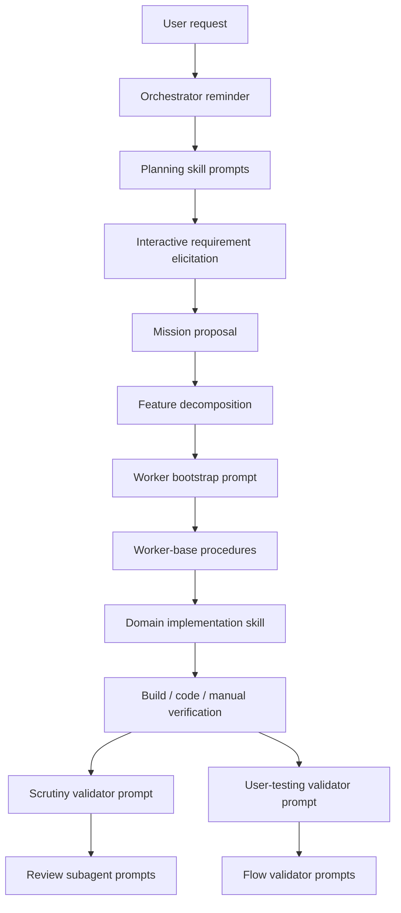

# Reverse Engineering Droid Prompt Stack By Phase

This is the single consolidated document for the recovered Droid mission prompt stack from the active Pacman mission.

It combines:

1. the phase architecture
2. the approval and control model
3. the strongest verbatim prompt text I could recover
4. the runtime interpretation of how those prompts are used

## Evidence Sources

- session JSONL logs in `/Users/tonyholovka/.factory/sessions/-Users-tonyholovka-workspace-pm2/`
- mission artifacts in `/Users/tonyholovka/.factory/missions/e194ccd7-34d1-4d05-819a-0146a919e7f8/`
- local droid definitions in `/Users/tonyholovka/.factory/droids/`

The important point is that Droid does not appear to send one monolithic prompt. It assembles an effective prompt stack from:

1. bootstrap reminders
2. activated skill bodies
3. task-specific feature payloads
4. mission artifacts injected as tool results
5. subagent task prompts

## Overall Phase Map



## 1. Planning

### Primary source

- `/Users/tonyholovka/.factory/sessions/-Users-tonyholovka-workspace-pm2/e194ccd7-34d1-4d05-819a-0146a919e7f8.jsonl`

### Orchestrator bootstrap

The planning session includes an explicit orchestrator reminder:

```text
REMINDER: You are the orchestrator. Your role is to plan, design worker systems, and steer execution. Do NOT implement code yourself.
```

This is the role-setting prompt for planning mode.

### Planning skill: `mission-planning`

Recovered phase structure:

```text
Phase 1: Understand Requirements (INTERACTIVE)
Phase 2: Identify Milestones
Phase 3: Confirm Milestones (INTERACTIVE)
Phase 4: Think About Infrastructure & Boundaries
Phase 5: Set Up Credentials & Accounts (INTERACTIVE)
Phase 6: Plan Testing Strategy
Validation Readiness Dry Run
Phase 7: Create Mission Proposal
```

Recovered planning behavior:

```text
Ask clarifying questions one at a time. Do not assume missing requirements.
```

```text
Create milestone breakdowns that can be executed independently and validated clearly.
```

```text
Call propose_mission with the detailed markdown proposal once the plan is confirmed.
```

The planning prompt is procedural and strongly approval-gated.

### Worker-system design skill: `define-mission-skills`

Recovered system-design layer:

```text
Design the worker system for the mission.
```

```text
Think through worker boundaries, handoff quality, validation rigor, and what skills each worker needs.
```

```text
Implementation workers should be expected to use TDD where appropriate and to perform manual verification, not just coding.
```

```text
Automatic validators are injected:
- scrutiny-validator
- user-testing-validator
```

This is the second planning prompt layer. It designs the worker architecture, not the product.

### Interactive planning prompts

The planning session asks one-at-a-time questions such as:

```text
What platform should this run on?
```

```text
Do you want a faithful classic Pacman implementation, or are you open to changes or extra mechanics?
```

```text
Do you want a specific stack or framework, or should I choose one?
```

In this mission, the answers were:

```text
HTML5
faithful classic Pacman
Phaser + Vite
```

### Planning outputs

The planning phase produced:

- `mission.md`
- `validation-contract.md`
- `features.json`

These are not just outputs. They are later re-injected into worker runs as prompt context.

## 2. Approvals

### Primary source

- `/Users/tonyholovka/.factory/sessions/-Users-tonyholovka-workspace-pm2/e194ccd7-34d1-4d05-819a-0146a919e7f8.jsonl`

Approval is explicit in the planning prompt.

### Approval gate 1: milestone confirmation

Recovered approval text:

```text
Does this cover everything? Any areas missing or out of scope?
```

```text
You need explicit user confirmation to proceed.
```

### Approval gate 2: infrastructure confirmation

Recovered approval text:

```text
Does this setup work for you?
```

```text
You need explicit user confirmation to proceed.
```

### Approval gate 3: testing strategy confirmation

Recovered behavior:

```text
Run a validation readiness dry run before finalizing the mission proposal.
```

```text
If validation cannot run as originally planned, present the alternative and get explicit approval before proceeding.
```

### Practical conclusion on approvals

Approvals are primarily in planning, not implementation.

The system appears to require human agreement on:

- mission structure
- infrastructure boundaries
- testing/validation strategy

After that, execution becomes much more autonomous.

## 3. Execution Bootstrap

### Primary sources

- `/Users/tonyholovka/.factory/sessions/-Users-tonyholovka-workspace-pm2/fae4c5c7-0ad8-4e13-ac17-a92928e6cf5e.jsonl`
- `/Users/tonyholovka/.factory/sessions/-Users-tonyholovka-workspace-pm2/764078cb-be63-42a7-a3f9-eac2d3296168.jsonl`
- `/Users/tonyholovka/.factory/sessions/-Users-tonyholovka-workspace-pm2/34764f5e-163e-46bb-ac3a-c631c60a6bd9.jsonl`
- `/Users/tonyholovka/.factory/sessions/-Users-tonyholovka-workspace-pm2/3ba32234-e89e-47f8-aeb1-74f341e8bab6.jsonl`
- `/Users/tonyholovka/.factory/sessions/-Users-tonyholovka-workspace-pm2/59235d30-d24c-47a9-a30a-ae0779ac3075.jsonl`

Every worker run starts with a layered bootstrap prompt.

### Layer 1: environment reminder

Representative excerpt:

```text
User system info (darwin 25.3.0)
Model: qwen3.5-plus [QWEN CODER]
Today's date: 2026-03-09
```

```text
The commands below were executed at the start of all sessions to gather context about the environment.
You do not need to repeat them, unless you think the environment has changed.
```

```text
IMPORTANT:
- Double check the tools installed in the environment before using them.
- Never call a file editing tool for the same file in parallel.
- Always prefer the Grep, Glob and LS tools over shell commands like find, grep, or ls for codebase exploration.
- Always prefer using the absolute paths when using tools, to avoid any ambiguity.
```

### Layer 2: todo reminder

Recovered bootstrap reminder:

```text
IMPORTANT: TodoWrite was not called yet. You must call it for any non-trivial task requested by the user.
```

### Layer 3: worker assignment prompt

Recovered worker bootstrap text:

```text
You are a worker assigned to implement feature "scoring-system".
```

```text
Your worker session id is: fae4c5c7-0ad8-4e13-ac17-a92928e6cf5e
```

```text
If you need browser automation during this mission, use agent-browser.
```

```text
If your feature has `fulfills` (assertion IDs), read those assertions from `validation-contract.md`. They specify the exact user-visible behavior your implementation must satisfy.
```

```text
1. First, invoke the 'mission-worker-base' skill for startup procedures
2. Then, invoke the 'frontend-game-developer' skill to complete your assigned feature
3. Call EndFeatureRun when done
```

```text
REMEMBER TO CALL ENDFEATURERUN WHEN YOU ARE DONE.
```

### Layer 4: assigned feature JSON

Recovered structure of the actual implementation brief:

```json
{
  "id": "scoring-system",
  "description": "Implement scoring system with pellet scoring (10pts), power pellet scoring (50pts), rolling score animation, and high score persistence via localStorage.",
  "skillName": "frontend-game-developer",
  "milestone": "core-foundation",
  "preconditions": [
    "Pellet consumption implemented",
    "Game state management setup"
  ],
  "expectedBehavior": [
    "Each pellet awards 10 points",
    "Each power pellet awards 50 points",
    "Score displays with rolling/counting animation",
    "Current score always visible at top of screen",
    "High score saved to localStorage",
    "High score persists after browser refresh"
  ]
}
```

This is the concrete execution brief.

## 4. Building / Implementation

### Primary sources

- `mission-worker-base` prompt in `/Users/tonyholovka/.factory/sessions/-Users-tonyholovka-workspace-pm2/fae4c5c7-0ad8-4e13-ac17-a92928e6cf5e.jsonl`
- `frontend-game-developer` prompt in the same session

### Common execution prompt: `mission-worker-base`

Recovered base worker procedure:

```text
You are a worker in a multi-agent mission. This skill defines the procedures that ALL workers must follow.
```

```text
Your feature's `fulfills` field lists validation contract assertions that must be true after your work.
Read these assertions carefully before starting.
```

```text
NEVER rename, delete, or modify the `.factory/` folder.
```

```text
`.factory/services.yaml` is the single source of truth for all commands and services.
```

```text
If manifest is broken: Return to orchestrator with `returnToOrchestrator: true` - don't try to fix it yourself.
```

```text
CRITICAL: Never Kill User Processes
```

```text
Run `commands.test` from `.factory/services.yaml`. This verifies the mission is in a healthy state before you start.
```

```text
Do NOT pipe validator output through `| tail`, `| head`, or similar. Pipes can mask failing exit codes.
```

This is the universal execution-control prompt.

### Domain implementation prompt: `frontend-game-developer`

Recovered procedure:

```text
Understand the feature requirements and validation expectations before changing code.
```

```text
Write tests first for the requested behavior where practical.
```

```text
Implement the feature so the expected behavior is satisfied exactly.
```

```text
Perform manual verification in the browser.
```

```text
Run the project validators such as typecheck and lint before handoff.
```

```text
Verify adjacent behavior so you do not regress earlier features.
```

### Actual building sequence observed

The worker followed the prompt stack in this order:

1. invoke `mission-worker-base`
2. read `mission.md`, `validation-contract.md`, `features.json`
3. add tests
4. implement feature changes
5. run typecheck and lint
6. run full test suite
7. launch dev server
8. perform manual browser verification
9. call `EndFeatureRun`

## 5. Testing

### Primary sources

- `/Users/tonyholovka/.factory/sessions/-Users-tonyholovka-workspace-pm2/34764f5e-163e-46bb-ac3a-c631c60a6bd9.jsonl`
- `/Users/tonyholovka/.factory/droids/user-testing-flow-validator.md`

### Validator bootstrap

Recovered bootstrap text:

```text
You are a worker assigned to implement feature "user-testing-validator-core-foundation-fixes".
```

```text
1. Invoke the 'user-testing-validator' skill to complete your assigned validation
2. Call EndFeatureRun when done
```

### `user-testing-validator` prompt

Recovered validator procedure:

```text
You validate a milestone by determining which assertions are testable, setting up the environment, spawning flow validator subagents, and synthesizing results.
```

```text
Determine testable assertions from features' fulfills field.
```

```text
Set up environment, start required services, and seed data if needed.
```

```text
Spawn flow validator subagents in parallel.
```

```text
Update validation-state.json with the synthesized results.
```

### Flow-validator subagent prompt

Recovered from `/Users/tonyholovka/.factory/droids/user-testing-flow-validator.md`:

```text
You are a subagent spawned to test specific validation contract assertions through the real user surface.
```

```text
Use ONLY your assigned credentials and data namespace.
```

```text
Read `{missionDir}/AGENTS.md` for `## Testing & Validation Guidance`.
```

```text
For each assigned assertion, test it through the real user surface.
```

```text
Take screenshots at key points (REQUIRED for every UI assertion)
Check console errors after each flow
Note relevant network requests
```

```text
If infrastructure isn't working: retry only non-disruptive fixes, then mark affected assertions as blocked.
Do NOT restart services or modify shared infrastructure.
```

```text
Test only YOUR assigned assertions. Do not test others. Do not fix code.
```

### Testing decomposition observed in practice

The user-testing validator session shows this pattern:

1. compute which assertions are covered by the milestone
2. spawn focused flow validators
3. each flow validator produces structured evidence
4. parent validator synthesizes those reports
5. `validation-state.json` is updated
6. results are committed and handed back to the orchestrator

## 6. Review / Verification

### Primary sources

- `/Users/tonyholovka/.factory/sessions/-Users-tonyholovka-workspace-pm2/3ba32234-e89e-47f8-aeb1-74f341e8bab6.jsonl`
- `/Users/tonyholovka/.factory/droids/scrutiny-feature-reviewer.md`

### Review validator bootstrap

Recovered bootstrap text:

```text
You are a worker assigned to implement feature "scrutiny-validator-core-foundation".
```

```text
1. Invoke the 'scrutiny-validator' skill to complete your assigned validation
2. Call EndFeatureRun when done
```

### `scrutiny-validator` prompt

Recovered review procedure:

```text
You validate a milestone by running validators and spawning subagents to review features.
```

```text
Run the full test suite, typecheck, and lint from `.factory/services.yaml`.
```

```text
If any validator fails:
- Call `EndFeatureRun` with `successState: "failure"` and `returnToOrchestrator: true`
- Include failures in `handoff.discoveredIssues`
- Do not proceed to feature review
```

```text
Review ALL completed implementation features in this milestone.
```

```text
Spawn subagents in parallel when reviewing multiple features.
```

```text
Collect all code review issues, deduplicate, assign severity.
```

```text
If ANY review reported blocking issues: `status: "fail"`
If all reviews passed or only have non-blocking issues: `status: "pass"`
```

### Review-subagent prompt

Recovered from `/Users/tonyholovka/.factory/droids/scrutiny-feature-reviewer.md`:

```text
You are a code reviewer spawned as a subagent to scrutinize a completed feature.
```

```text
Your job: deep code review of this feature's implementation. You do NOT re-run validators.
```

```text
Find the reviewed feature in features.json.
Then gather:
1. Handoff
2. Git diff
3. Transcript skeleton
4. Worker skill
```

```text
Does the implementation fully cover what the feature's `description` and `expectedBehavior` require?
Are there any bugs, edge cases, or error states that were missed?
Flag specific issues with file path and line references.
```

```text
Review only YOUR assigned feature. Do not fix code. Do not run validators. Do not launch services, browsers, or other heavy processes.
```

### Review model

The recovered review prompt is explicitly evidence-driven:

```text
review = validator pass/fail + reviewer evidence + diff/handoff/transcript comparison
```

It is not just a second test run.

## Strongest Takeaways

The prompt text shows a consistent method:

- planning is interactive and approval-gated
- implementation is feature-scoped and artifact-driven
- testing is assertion-based and delegated to focused subagents
- review is validator-gated, then evidence-based, not just heuristic
- the system uses explicit handoffs and structured JSON artifacts to move context between phases

That is the clearest evidence of how Droid is decomposing and controlling delivery work in the current mission system.

### Practical conclusion on building prompts

Building is controlled by two prompt layers:

- generic mission execution discipline
- domain-specific implementation discipline

That means their “build prompt” is not just “implement X”.
It is “follow worker-base process, then follow domain skill process, then report in structured handoff form”.

## 5. Testing

Primary sources:

- `user-testing-validator` prompt in `34764f5e-163e-46bb-ac3a-c631c60a6bd9.jsonl`
- `user-testing-flow-validator.md`
- mission `validation-contract.md`

### Validation contract as prompt input

`validation-contract.md` is injected as a tool result into validator sessions.

That means the detailed assertion definitions are part of the effective test prompt.

### Testing coordinator prompt: `user-testing-validator`

Recovered responsibilities:

- determine testable assertions from `fulfills`
- start services
- seed test data
- decide correct testing tool per surface
- resolve setup issues when possible
- plan isolation strategy for parallel testing
- spawn flow validators
- synthesize results
- update `validation-state.json`
- update `user-testing.md` and `services.yaml` when setup knowledge is discovered

This is not a single test runner prompt. It is a testing orchestration prompt.

### Flow-level test prompt: `user-testing-flow-validator`

Recovered responsibilities:

- test specific assigned assertions only
- use assigned credentials / namespace only
- read `Testing & Validation Guidance`
- use real user surface
- capture screenshots for UI
- capture console errors
- capture network details
- report frictions and blockers
- write structured JSON result

This is the closest thing to a concrete per-test execution prompt.

### Testing prompt architecture

There are at least three layers:

1. planning-time testing strategy prompt
2. milestone testing orchestrator prompt
3. per-flow validator prompt

## 6. Review / Verification

Primary sources:

- `scrutiny-validator` prompt in `3ba32234-e89e-47f8-aeb1-74f341e8bab6.jsonl`
- `scrutiny-feature-reviewer.md`

### Review coordinator prompt: `scrutiny-validator`

Recovered responsibilities:

- run validators: test, typecheck, lint
- if validators fail, stop and return failure
- determine which features need review
- spawn review subagents
- synthesize blocking vs non-blocking issues
- triage shared-state observations
- recommend AGENTS/skill updates
- commit validation artifacts
- always return to orchestrator

This is a review orchestration prompt, not a code review prompt itself.

### Per-feature review prompt: `scrutiny-feature-reviewer`

Recovered responsibilities:

- read feature metadata
- read handoff
- inspect git diff
- inspect worker transcript skeleton
- inspect worker skill file
- review for missing behavior, bugs, edge cases
- identify shared-state knowledge gaps
- for fix reviews, compare original failure and fix
- write structured JSON review result

This is the concrete code-review prompt.

## 7. Phase Summary

### Planning prompts

- orchestrator reminder
- `mission-planning`
- `define-mission-skills`
- interactive requirement elicitation

### Approval prompts

- milestone confirmation
- infrastructure confirmation
- testing strategy confirmation
- alternative validation approval when needed

### Building prompts

- worker bootstrap assignment
- `mission-worker-base`
- domain worker skill such as `frontend-game-developer`

### Testing prompts

- planning-time testing strategy
- `user-testing-validator`
- `user-testing-flow-validator`
- `validation-contract.md` injected as assertion context

### Execution prompts

- environment bootstrap
- mission artifact injection
- assigned feature JSON
- task-specific skill body
- closure and handoff instructions

## 8. Strongest Conclusion

The Droid mission system appears to implement prompt composition by phase.

It does not rely on one static “system prompt”.

Instead, each phase gets its own procedural prompt layer:

- planning layer
- approval layer
- worker bootstrap layer
- implementation layer
- testing orchestration layer
- flow validation layer
- review orchestration layer
- feature review layer

That layered prompt design is likely one of the main reasons the system can keep planning, execution, testing, and review separate.
