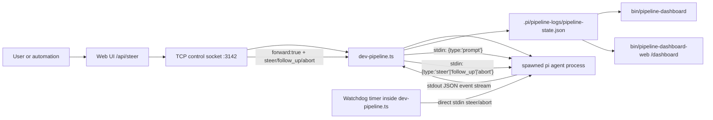

# Reverse Engineering: Current Droid "Mission Control" Path

Date: 2026-03-09

## Scope

This note reverse-engineers the current "mission control" behavior from the checked-in droid entrypoints and source wiring in this repo.

Important clarification: the current "droid binary" is not a compiled native binary in this repository. The two shipped entrypoints are script wrappers:

- `bin/pipeline-dashboard`
- `bin/pipeline-dashboard-web`

The actual control logic lives in `extensions/dev-pipeline.ts`.

## Executive Summary

The current system has one real control plane and two views:

1. `dev-pipeline.ts` is the runtime authority.
2. `.pi/pipeline-logs/pipeline-state.json` is the shared monitoring state.
3. `pipeline-dashboard` and `pipeline-dashboard-web` are observers/control surfaces on top of that state.

The steering path is not a hidden internal "mission control" subsystem. It is a plain JSON-RPC-over-stdin model:

1. `dev-pipeline.ts` spawns child `pi` agent processes.
2. It sends the initial task with `{"type":"prompt","message":"..."}` on child stdin.
3. It can later send `{"type":"steer","message":"..."}`, `{"type":"follow_up","message":"..."}`, or `{"type":"abort"}` on that same stdin.
4. The web control center is just a bridge that forwards those commands over TCP to `dev-pipeline.ts`.

## Confirmed Components

### 1. Runtime owner: `dev-pipeline.ts`

Confirmed in `extensions/dev-pipeline.ts:526-607`:

- `activeAgents` tracks visible running agents.
- `agentProcesses` stores live child process handles.
- `connectControlSocket()` connects to TCP port `3142`.
- `registerAgentOnControl()` registers each running agent with the web control server.
- `handleForwardedCommand()` converts forwarded control messages into JSON written to the child's stdin.

### 2. Agent execution model: spawned Pi RPC subprocesses

Confirmed in `extensions/dev-pipeline.ts:995-1007`:

- Each agent is spawned as `pi` with piped stdin/stdout/stderr.
- The initial task is not passed as a CLI argument.
- The initial task is written to stdin as:

```json
{"type":"prompt","message":"..."}
```

This is the core mechanism the rest of the control path relies on.

### 3. Monitoring state file: `pipeline-state.json`

Confirmed in `extensions/dev-pipeline.ts:686-735`:

`dev-pipeline.ts` writes `.pi/pipeline-logs/pipeline-state.json` with:

- pipeline running state
- branch
- current phase
- per-phase and per-task status
- recent log lines
- active agent metadata

The terminal dashboard reads this file directly, confirmed in `bin/pipeline-dashboard:8-10` and `bin/pipeline-dashboard:78-91`.

### 4. Web control center: HTTP + SSE + TCP bridge

Confirmed in `bin/pipeline-dashboard-web:11-24` and `bin/pipeline-dashboard-web:56-153`:

- HTTP server defaults to port `3141`
- TCP control socket defaults to port `3142`
- agents register with `{ "type": "register", "agentId": "...", "sessionKey": "..." }`
- steer/follow_up/abort commands are forwarded back to the registered extension socket

The HTTP steering path is confirmed in `bin/pipeline-dashboard-web:208-225`.

## Current Control Flow



## Detailed Request/Response Path

### Manual steering from the web UI

1. Browser POSTs to `/api/steer`.
2. `pipeline-dashboard-web` logs the request and optionally forwards it immediately if the target agent is registered.
3. The forwarding payload is newline-delimited JSON sent to the TCP socket.
4. `dev-pipeline.ts` receives `{ forward: true, type, message, agentId }`.
5. `handleForwardedCommand()` looks up the child process from `agentProcesses`.
6. The extension writes the JSON-RPC command to that process's stdin.
7. The child `pi` process receives the interruption and continues on the same session.

Relevant code:

- `bin/pipeline-dashboard-web:95-153`
- `bin/pipeline-dashboard-web:209-225`
- `extensions/dev-pipeline.ts:586-607`

### Automatic steering from the watchdog

Confirmed in `extensions/dev-pipeline.ts:1031-1073`:

1. When `timeoutMs` is configured, `dev-pipeline.ts` starts a warning timer and a hard timer.
2. At warning time, it writes a `type: "steer"` JSON command directly to the child stdin requesting a structured JSON blocker summary.
3. At hard timeout, it writes `type: "abort"` to stdin, then escalates to `SIGTERM` and finally `SIGKILL` if needed.

This path does not require the web control center at all.

## What You Can Reuse

If you want to utilize the same current "mission control" method elsewhere, the reusable pattern is:

1. Run agents as long-lived `pi` subprocesses in RPC mode with piped stdin/stdout.
2. Keep a registry of live process handles keyed by a stable session key.
3. Expose a bridge transport for steering.
   In this repo that bridge is TCP on port `3142`.
4. Forward small JSON commands into the subprocess stdin.
5. Keep a separate state file for dashboards and passive observers.

The minimum usable commands are already documented in `README.md:759-764`:

- `{"type":"prompt","message":"..."}`
- `{"type":"steer","message":"..."}`
- `{"type":"follow_up","message":"..."}`
- `{"type":"abort"}`

## Likely Dead / Incomplete Path

There is one path that looks vestigial or unfinished.

`pipeline-dashboard-web` writes a fallback file:

- `bin/pipeline-dashboard-web:23`
- `bin/pipeline-dashboard-web:156-161`

That file is `.pi/pipeline-logs/pipeline-steer.json`.

I searched the current repo for any consumer of `pipeline-steer.json` and found no readers. So at the moment:

- confirmed live path: TCP socket forwarding plus direct stdin steering
- unconfirmed/dead path: file-based steering via `pipeline-steer.json`

Unless there is an external process outside this repo polling that file, it is not part of the active control plane right now.

## Bottom Line

The current "mission control" behavior is implemented as a small control stack around `dev-pipeline.ts`, not as a standalone hidden binary subsystem:

- process orchestration lives in `dev-pipeline.ts`
- monitoring state lives in `pipeline-state.json`
- browser control is a TCP bridge in `pipeline-dashboard-web`
- the actual steering primitive is JSON commands written to child `pi` stdin

If you want to replicate or extend the current approach, the key integration point is the child-process registry plus the stdin JSON-RPC contract, not the dashboard UI.
