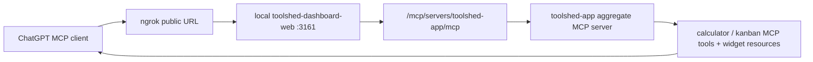
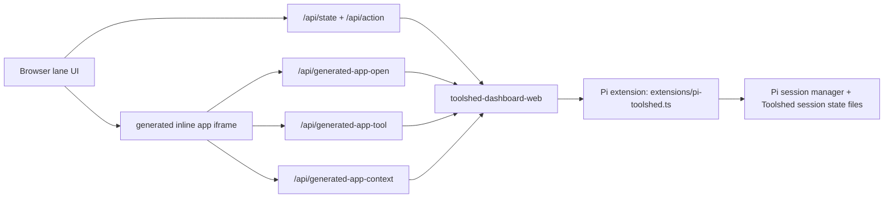

# Toolshed App Runtime Map

## Purpose

This document is the current source of truth for how the Toolshed app stack hangs together across:

- the Pi lane web UI
- the local Toolshed dashboard host
- the Pi extension session state
- the ChatGPT MCP app path

The point of this document is to reduce accidental regressions. The system has multiple surfaces that look similar but are not identical. A change that is safe for one surface can still break another if it changes the host contract, timing, or state ownership.

## The Four Runtime Surfaces

There are four distinct surfaces in play:

1. Pi extension state owner
   File: `extensions/pi-toolshed.ts`
2. Local browser host / lane UI / MCP proxy
   File: `bin/toolshed-dashboard-web`
3. MCP aggregate server surface
   File: `features/toolshed-mcp-apps/toolshed-app/server.ts`
4. Individual widget apps
   Files:
   - `features/toolshed-mcp-apps/skeuomorphic-calculator-toolbox-app/mcp-app.tsx`
   - `features/toolshed-mcp-apps/github-project-kanban-board-app/mcp-app.tsx`

These are connected, but they are not the same process and they do not all hydrate state the same way.

## End-to-End Topology

### ChatGPT MCP path



Key point:

- ChatGPT does not talk to the Pi lane directly.
- It talks to the public MCP endpoint, which is tunneled to the local `toolshed-dashboard-web` process.
- That process proxies to the aggregate MCP server surface.

### Pi lane path



Key point:

- The lane does not render widget templates through the MCP client path.
- It renders its own generated iframe shell and injects a local bridge script.
- That bridge script routes app actions back through local dashboard endpoints.

## Where Truth Lives

### 1. Pi session truth

Owned by: `extensions/pi-toolshed.ts`

This is the authoritative owner for:

- current Pi session id
- current Pi session file
- session catalog
- lane items derived from the current Pi session
- Toolshed inline app session state written back into the Pi session model

Relevant code areas:

- `buildToolshedState(...)`
- `buildSessionCatalogEntry(...)`
- `toolshed_open_app`
- `session_start`
- `session_switch`
- `session_fork`

This extension writes the current Toolshed state snapshot to disk so the web host can read it.

### 2. Lane snapshot truth

Owned by: `bin/toolshed-dashboard-web`

This host reads:

- the current Toolshed state file
- per-session snapshot files

And it serves:

- `/api/state`
- `/api/action`
- generated inline app routes such as `/api/generated-app-open`

Important nuance:

- The dashboard is a reader/controller over extension state.
- It is not supposed to invent a separate authoritative session history.

### 3. ChatGPT widget truth

Owned by: MCP tool/resource responses from:

- `features/toolshed-mcp-apps/toolshed-app/server.ts`
- app server registrations for calculator and kanban

ChatGPT gets:

- tool output
- widget resource HTML
- widget metadata such as `openai/widgetDomain` and `openai/widgetCSP`

It does not read the lane’s `/api/state`.

### 4. Inline app persisted state

Owned by: `extensions/pi-toolshed.ts`

The extension persists inline app state back into session-backed Toolshed state so apps can be reconstructed in the lane. The dashboard forwards sync messages, but it should not become the source of truth.

## Current Public Server Shape

The intended public MCP server is:

- `toolshed-app`

Defined in:

- `features/toolshed-mcp-apps/toolshed-app/server.ts`

This aggregate server registers:

- calculator features
- GitHub kanban board features

The dashboard also aliases the old calculator-specific public route to `toolshed-app` when the aggregate server exists, so old connector URLs can still resolve to the unified server.

## The Lane Host Contract

The generated lane iframe host is built in:

- `bin/toolshed-dashboard-web`

Function:

- `buildGeneratedAppBridgeScript(...)`

That bridge injects a local host object onto:

- `window.app`
- `window.openai`
- `window.mcp.app`

It currently exposes these behaviors:

- `callServerTool(...)`
- `callTool(...)`
- `updateModelContext(...)`
- `sendMessage(...)`
- `sendFollowUpMessage(...)`
- `requestDisplayMode(...)`
- `syncToolshedSession(...)`
- `openLink(...)`
- `theme`
- `toolInput`
- `toolOutput`
- `widgetState`

It also emits:

- `openai:set_globals`
- `toolshed-display-mode`

That means the lane is already trying to emulate an OpenAI-style app host while still preserving Toolshed-only behavior such as `syncToolshedSession(...)`.

## Why Calculator Works Under the New Host Cleanup

The calculator exercises a small subset of the host contract.

In practice it depends on:

- initial hydration from `widgetState` or `toolOutput`
- `callTool("calculator_press_key", ...)`
- `sendFollowUpMessage(...)`
- `syncToolshedSession(...)`
- keyboard/click event handling entirely inside the widget

It does not depend heavily on:

- repeated external rehydration cycles
- display-mode toggling
- `openLink(...)`
- drag/drop rebinding
- optimistic local state reconciliation
- multi-tool workflow with queueing

So calculator passing only proves that the basic host transport is good enough for a small widget.

### Host API usage matrix

| Host capability | Calculator | Kanban |
| --- | --- | --- |
| `theme` | yes | yes |
| `toolInput` / `toolOutput` / `widgetState` hydration | yes | yes |
| `callTool(...)` | yes, single tool path | yes, multiple tools |
| `sendFollowUpMessage(...)` | yes | no |
| `syncToolshedSession(...)` | yes | yes |
| `updateModelContext(...)` | no | yes |
| `requestDisplayMode(...)` | no | yes |
| `openLink(...)` | no | yes |
| optimistic local state | no | yes |
| queued reconciliation after server refresh | no | yes |
| drag/drop rebinding | no | yes |

That is the practical difference. Calculator is proving the small contract. Kanban is proving the larger one.

## Why Kanban Exposes More Fragility

The kanban widget exercises a much wider surface area.

It depends on:

- initial hydration
- repeated hydration after tool calls
- multiple tool calls
- optimistic local board state
- delayed reconciliation after server refresh
- drag/drop move queues
- `updateModelContext(...)`
- `requestDisplayMode(...)`
- `openLink(...)`
- repeated DOM rebinding after re-render
- session sync back into Toolshed state

So the kanban widget is effectively the stress test for the host contract.

The calculator and kanban are not proving the same thing.

## The Important Current Finding

As of this branch state:

- calculator works in the lane
- calculator works in ChatGPT
- kanban works in the lane
- kanban works in ChatGPT when kept on the older widget host logic from `master`
- kanban breaks in ChatGPT when moved onto the newer shared runtime abstraction

That means:

- the transport path is not the main problem
- the aggregate `toolshed-app` MCP surface is not the main problem
- the new abstraction is incomplete for the kanban widget’s host needs

In other words:

- the cleanup direction is valid in principle
- the current shared abstraction does not yet fully represent the kanban widget’s real host contract

## Safe Boundary For Future Changes

Do not treat “calculator works” as proof that the host abstraction is complete.

The safe boundary is:

1. Keep `toolshed-app` as the single public MCP surface.
2. Keep calculator as the canary for the cleaned-up host abstraction.
3. Keep kanban on the known-good `master` widget host contract until every required host semantic is accounted for.
4. Do not refactor Pi session selection, blank-session handling, or lane session hydration in the same branch as host-contract cleanup.

That last point matters. Session isolation and host-contract cleanup touch different failure planes. Mixing them has already caused regressions.

## Change Rules

### Rule 1: Treat these as separate planes

Every change should declare which plane it touches:

- Pi extension state owner
- dashboard/lane host
- aggregate MCP server
- widget app code

If a change touches more than one plane, it needs an explicit reason.

### Rule 2: Do not change kanban host wiring casually

Kanban is the highest-risk widget because it uses the richest host surface.

If kanban host wiring changes, validate:

- lane rendering
- ChatGPT rendering
- tool calls
- move persistence
- refresh
- fullscreen
- link opens

### Rule 3: Do not mix session-state changes with widget-host changes

These are independent concerns:

- blank new Pi session
- carry-over of inline app state
- app host bridge cleanup

They should not be repaired in the same patch set unless absolutely necessary.

### Rule 4: Verify the served live widget, not just the source file

For ChatGPT, the relevant question is not only “what is in the repo?”

It is:

- what does `/mcp/servers/toolshed-app/mcp` serve right now?

That must be checked against the running local dashboard service after restart.

### Rule 5: Prefer per-app migration over big-bang abstraction

The right order is:

- calculator first
- kanban second

Do not move both apps onto a new runtime abstraction in one step and assume parity.

## Operational Debug Checklist

When something breaks, check these in order:

1. Is the local dashboard process restarted on the branch you are testing?
2. Is ngrok still pointing to that local process?
3. Does the live MCP endpoint serve the widget HTML you think it serves?
4. Is the failing surface:
   - lane only
   - ChatGPT only
   - both
5. If ChatGPT-only:
   - reconnect/refresh the connector after restart
6. If lane-only:
   - inspect `buildGeneratedAppBridgeScript(...)`
   - inspect `/api/generated-app-open`
   - inspect `/api/generated-app-tool`
7. If the widget sees data but fails to render:
   - the likely break is in widget host/runtime semantics, not server data

## Live Boundary Check

There is now a local verifier for the live MCP-served widget boundary:

```bash
./bin/verify-toolshed-widget-hosts
```

What it checks against the live local MCP host:

- calculator must still be served with the shared host runtime
- kanban must still be served with the legacy host path
- kanban must not silently switch onto `createHostRuntime(...)`

Use this before asking for manual UAT after any host-runtime or widget-host change.

## What Should Happen Next

The next safe move is not another broad rewrite.

The next safe move is:

1. Freeze this runtime map.
2. Keep kanban on the known-good bridge.
3. Compare the kanban host calls against the new calculator/shared-host contract.
4. Add only the missing semantics required by kanban.
5. Migrate kanban only when the new host path is behaviorally equivalent.

If that equivalence cannot be achieved cleanly, stop trying to force one runtime adapter and keep a small app-specific host adapter for kanban.

That is still a valid architecture if it is explicit and stable.

## Short Version

The stack is fragile when we pretend these are the same surface:

- lane host
- Pi session owner
- MCP aggregate server
- ChatGPT widget host

They are connected, but they are not identical.

The calculator proves the small host contract.
The kanban proves the large host contract.

So the right engineering boundary is:

- one public MCP surface
- one Pi session owner
- one local dashboard host
- app-by-app host normalization, starting with calculator
- no forced kanban migration until its full host semantics are represented
